# Beginner's Automation Foundations: An OpenClaw Compatible Skills Framework for Autonomous Agentic Google Workspace Orchestration in Python


- **Project Repository:** https://github.com/cjbaezilla/Skills-Framework-for-Autonomous-Agentic-Google-Workspace-Orchestration-Tutorial

## Introduction: From Manual Tasks to Autonomous Orchestration

This project includes a fully configured Google Workspace integration that allows you to manage emails and calendar events programmatically. The system is built with security and ease of use in mind, providing both a core library for developers and ready-to-use command line tools for everyday tasks.

The integration supports four main operations: sending emails, reading emails, replying to emails, and creating calendar events. All functionality is built on top of Google's official APIs and uses OAuth 2.0 for secure authentication.

## Understanding Agentic Orchestration

Agentic orchestration represents a fundamental shift in how software systems interact with the world. Rather than executing static, predetermined scripts, orchestrated systems deploy specialized AI agents that can understand intent, plan actions, and coordinate multiple capabilities to achieve complex goals. In the OpenCode ecosystem, this manifests as a sophisticated architecture where autonomous agents possess distinct personalities, tools, and permissions, working independently or collaboratively to complete multi-step workflows.

The Google Workspace integration you are examining serves as a cornerstone capability within this orchestrated framework. It transforms the humble tasks of sending emails and managing calendars from manual procedures into programmable skills that AI agents can wield autonomously. When an agent receives a request such as "schedule a meeting with the team based on our discussion," it can leverage these skills to read incoming messages, extract temporal details, create calendar events with appropriate attendees, and dispatch notifications, all without human intervention.

This capability embodies what the broader open source community calls the "openclaw" vision: systems that can grab control of computer functions and external services to act autonomously in the world. The term evokes the image of an intelligent entity that can reach out and manipulate digital tools as deftly as a human would, but with machine precision and endless patience. Dissecting this Google integration provides an excellent educational entry point into agentic orchestration because it demonstrates several fundamental patterns: secure authentication handling, API abstraction, skill definition, and workflow composition.

The integration operates as four distinct skills within the OpenCode system, each representing a discrete capability that agents can discover and invoke. This skill-based architecture creates a modular, extensible framework where new functionalities can be added without modifying existing agents. The skills themselves follow a consistent structure: they declare their purpose, define required and optional parameters, provide usage examples, and reference detailed documentation. This self-describing nature allows agents to understand what each skill does and when to use it, enabling dynamic capability selection based on the task at hand.

Understanding this system requires appreciating the layered architecture that makes autonomous operation possible. At the foundation lies the `google_operations.py` library, which handles the intricate details of OAuth 2.0 authentication, token refresh, and direct API calls to Google's services. Above that sit four command-line scripts that provide human-friendly interfaces for each capability. At the highest level, skills wrap these scripts with metadata that machines can parse, creating a bridge between natural language understanding and concrete API actions. This separation of concerns ensures that each layer can evolve independently while maintaining clear contracts between them.

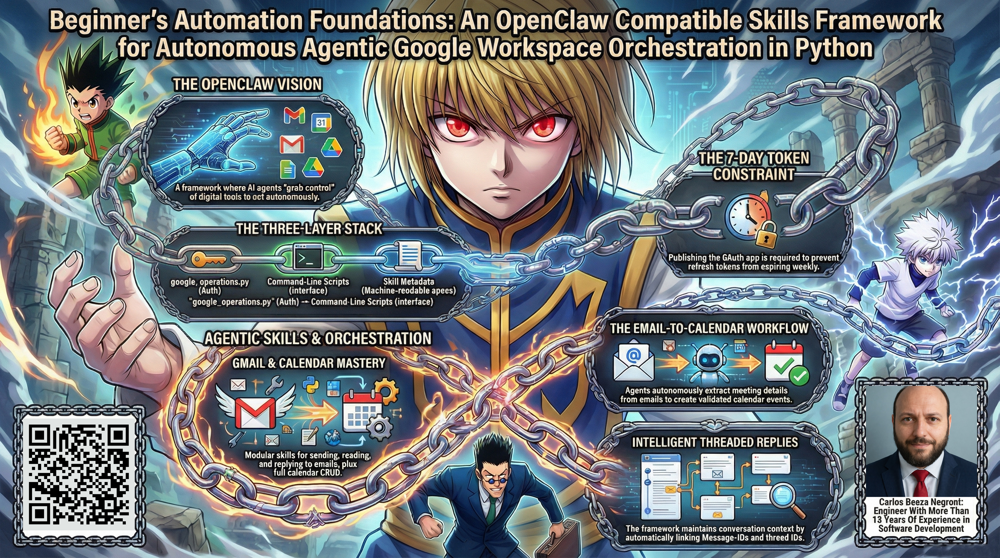

### The OpenClaw Vision: From Tools to Autonomous Actors

The concept of "openclaw" emerges from a simple yet profound observation: traditional software tools require human operators to direct their actions. A human clicks buttons, fills forms, and makes decisions. Agentic systems invert this relationship, placing the AI in the driver's seat while humans provide high-level guidance. The term "claw" metaphorically represents the agent's ability to reach into the digital environment and manipulate tools, APIs, and interfaces to accomplish goals. The "open" prefix signifies that this capability is not proprietary or closed-source but rather a community-driven framework for building autonomous systems.

In this context, the Google Workspace integration demonstrates the claw metaphor literally: it gives agents the ability to interact with one of the most ubiquitous business platforms in existence. When an agent sends an email, it exercises a form of digital agency that was once exclusively human. It can compose messages, select recipients, and manage threading, all according to semantic understanding rather than pre-programmed templates. Similarly, calendar management allows agents to coordinate schedules, create meetings, and manage invitations. These are not mere automation tricks; they represent genuine participation in human workflows.

Dissecting this integration for educational purposes reveals how "claw" capabilities are architected in practice. The system must solve several non-trivial problems: authenticating securely with external services, maintaining sessions across multiple invocations, handling API rate limits and transient failures, converting between human-readable inputs and machine-readable API calls, and providing clear feedback to both human supervisors and AI agents. Each of these problems has a well-designed solution in the codebase that serves as a template for building other skills.

The openclaw philosophy suggests that any digital capability can be wrapped as a skill and made available to autonomous agents. Email, calendar, file systems, databases, web APIs, command-line tools, all become accessible through a uniform interface. This uniformity is crucial because it allows agents to discover and use capabilities without knowing their implementation details. Just as a human can use a screwdriver without understanding metallurgy, an agent can send an email without knowing about SMTP protocols or OAuth token management. The skill system provides this abstraction layer, treating each capability as a black box with a clear contract.

Examining the Google integration illuminates how these contracts are defined and enforced. The SKILL.md files act as formal specifications that both humans and machines can read. They state precisely what the skill does, when to use it, what parameters it accepts, what it returns, and provide concrete examples. This specification is not an afterthought; it is the primary interface that enables agents to reason about available capabilities. When combined with the agent's natural language understanding, these specifications allow the agent to decide whether a particular skill matches the user's intent, construct appropriate parameter values, and interpret results.

### Agent Orchestration in Practice: Beyond Single Skills

While individual skills are powerful, the true potential of agentic orchestration emerges when multiple skills combine in coordinated workflows. The article.md file already presents two compelling examples: the booking workflow that transforms an email into a calendar event, and the intelligent reply agent that handles routine communications. These examples demonstrate orchestration in action, single natural language triggers that activate a sequence of skills, each contributing to the final outcome.

The booking workflow reveals several orchestration patterns worth examining in detail. First, it demonstrates cross-skill data flow: information extracted from an email (event details, attendees, time proposals) is fed directly into the calendar creation skill without human intervention. This requires not just technical integration but semantic understanding, the agent must recognize which email content maps to which calendar fields. Second, it shows confirmation and recovery patterns: the agent summarizes its findings and asks for human validation before proceeding, respecting that some decisions require oversight. Third, it illustrates error handling, what if the email lacks clear details? What if the calendar creation fails? A robust orchestration must anticipate and handle such contingencies.

The intelligent reply agent showcases a different orchestration pattern: monitoring and response. It periodically checks for unread messages, filters those requiring attention, analyzes content to determine appropriate responses, and executes reply actions with proper threading. This pattern resembles a daemon or background process but with cognitive capabilities. The agent does not merely reply to everything; it exercises judgment about what needs response and what tone is appropriate. Such nuanced decision-making distinguishes agentic automation from rigid rule-based systems.

These workflows also highlight the importance of authentication design for long-running operations. The article emphasizes that publishing the OAuth app is critical for agents that need to run without manual re-authentication. Without publishing, refresh tokens expire after seven days, breaking any autonomous process that spans more than a week. This constraint reveals a deeper principle: orchestrated systems often require persistent access to external services, and the authentication mechanisms must support long-lived sessions. The seven-day limit during testing serves as a safeguard against unauthorized persistent access, but for productive autonomous agents, publishing becomes necessary.

The skill architecture enables these orchestrations through a discovery and invocation mechanism. An agent can query what skills are available, read their specifications, and dynamically decide which ones to use. This is not hard-coded behavior but rather runtime decision-making based on the agent's understanding of its capabilities and the task requirements. When an agent encounters a task it cannot complete with available skills, it can signal this limitation clearly rather than failing ambiguously. This transparency is essential for building trust in agentic systems.

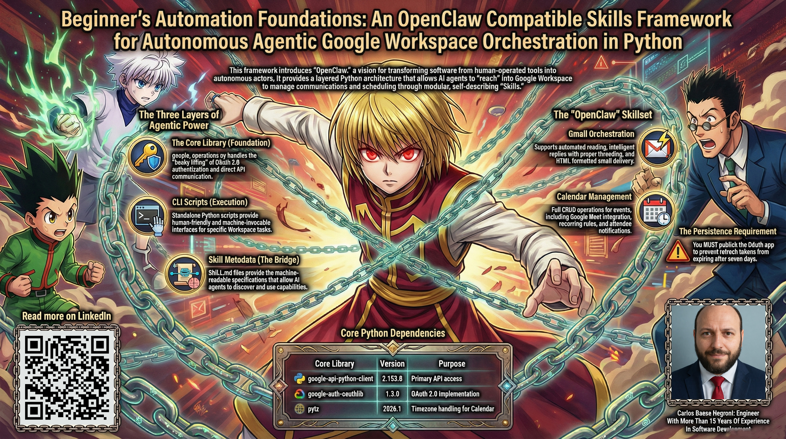

### Authentication as Foundation: OAuth 2.0 Deep Dive

A thorough understanding of the Google integration requires examining its authentication mechanism, because secure, reliable authentication forms the bedrock upon which all other functionality rests. The system implements OAuth 2.0, the industry standard for delegated authorization. Unlike simple API keys that grant blanket access, OAuth tokens are scoped to specific permissions and can be revoked independently. More importantly, the refresh token mechanism allows the system to maintain long-term access without storing user passwords or requiring repeated logins.

The authentication flow begins with the initial setup. The user obtains `google_credentials.json` from the Google Cloud Console, containing the OAuth client ID and client secret. These credentials identify the application to Google's servers but do not grant any access themselves. The first time the user runs any skill or script, the system opens a browser window to the Google consent screen. The user logs in with their Google account and is presented with a list of permissions the application requests: read and send email, manage calendar. After the user consents, Google redirects to a local endpoint with an authorization code. The application exchanges this code for an access token and a refresh token.

The access token is short-lived, typically valid for one hour. It is used in API calls to prove that the application has permission to act on behalf of the user. When the access token expires, the refresh token, which has a much longer lifespan, especially for published applications, is used to obtain a new access token without user involvement. This refresh happens automatically whenever the `google_operations.py` library detects an expired token. The tokens are saved to `google_token.json` for reuse across invocations.

For educational purposes, several aspects of this flow deserve careful study. First, the separation of `google_credentials.json` and `google_token.json` reflects a fundamental security principle: application identity and user delegation should be stored separately. The credentials file remains constant across users (in a multi-user deployment), while the token file is unique to each authorized user. Second, the automatic refresh logic demonstrates how to maintain session continuity in serverless or ephemeral environments where the process may not persist between calls. Third, the requirement to publish the application for long-term tokens illustrates how platforms balance convenience with security, imposing limits on unverified applications while granting more durable permissions to published ones.

The library functions `get_gmail_service()` and `get_calendar_service()` encapsulate all this complexity. They handle token loading, validation, refresh, and re-authentication if needed. Callers simply invoke these functions and receive ready-to-use API service objects. This encapsulation is crucial for the skill and script layers; it means each skill does not need to duplicate authentication logic. The consistency this provides across the codebase represents a best practice in software engineering: centralize cross-cutting concerns like security, logging, and error handling.

### Skill System Architecture: The Bridge Between Humans and APIs

The skill system constitutes the formal interface through which AI agents interact with the world. Each skill exists in its own directory under `skills/` with a standardized structure. The centerpiece is `SKILL.md`, a markdown document that defines the skill's purpose, usage patterns, parameters, return values, and examples. This document serves dual purposes: it is human-readable documentation, and it is machine-parsable specification. The OpenCode agent system reads these files to discover available capabilities and understand how to invoke them.

Consider the `send-email` skill as an illustration. Its `SKILL.md` file states clearly that the skill sends email messages through Gmail. It lists the required parameters (`--to`, `--subject`) and optional ones (`--cc`), and explains the choice between `--body` and `--body-file`. It provides concrete usage examples that show both simple and complex invocation patterns. It describes the return value (message ID on success) and error behavior (exit code 1 with error message). This specificity is essential: an agent parsing this specification can determine whether the skill matches a user's request, validate that all required parameters are present, and understand what to expect when the skill executes.

The skill metadata also includes information about when to use the skill, effectively defining its applicability conditions. For `send-email`, the description reads: "Sends an email using Gmail through the Google Gmail API with simple CLI." This indicates the skill's domain (Gmail), its action (sending), and its interface (command line). An agent can match such descriptions against the user's request to select appropriate skills. The system may have multiple communication-related skills, sending via Gmail, posting to Twitter, creating LinkedIn posts, and the agent must choose the right one for the context.

Beneath the metadata lies the implementation: a Python script at `scripts/google/send_email.py`. This script is standalone; it can be executed directly from the command line with the documented arguments. It uses the `google_operations` library to perform authentication and API calls. Similarly, `read-email.py`, `reply-email.py`, and `create_calendar_event.py` implement their respective skills. This decoupling of interface (skill definition) and implementation (script) allows the implementation to change without breaking agents, as long as the skill contract remains stable.

### Extending the System: Patterns and Principles

The Google integration, while comprehensive, serves as a template for adding new external service integrations. Any service that provides an API, and preferably an official Python client library, can be wrapped as a set of skills following the same patterns. The essential steps involve: obtaining API credentials, implementing authentication with token management, writing wrapper functions for desired operations, creating command-line interfaces, drafting skill metadata, and integrating into the system configuration.

Several patterns emerge from the existing code that guide such extensions. The library module pattern centralizes all authentication and low-level API interaction, shielding higher layers from API-specific details. The script pattern provides CLI interfaces with consistent argument parsing, error handling, and exit codes. The skill metadata pattern provides standardized, discoverable specifications. The configuration pattern registers skills in a central location while keeping their implementations independent. And the documentation pattern ensures that every skill has thorough reference material beyond the quick specification.

These patterns are not arbitrary; they serve specific goals in an orchestrated system. Modularity allows skills to be developed, tested, and updated independently. Consistency reduces cognitive load for agents and human developers alike. Discoverability enables agents to adapt to new capabilities without reprogramming. Documentation bridges the gap between specification and implementation, serving as the single source of truth for both humans and machines.

When designing new skills, one should ask: What is the minimal, clear contract this skill should expose? What parameters are essential versus optional? What errors might occur and how should they be reported? How does this skill relate to others in the same domain? The Google skills provide exemplary answers to these questions. The send/read/reply trio for email handles the full lifecycle of asynchronous communication. The create/read/update/delete/sequence for calendar covers event management comprehensively. Each skill does one thing well and does it consistently.

## Step-by-Step Setup

This section walks you through configuring Google Workspace integration for OpenCode. The process involves setting up a Google Cloud project, enabling APIs, configuring authentication, and obtaining credentials. Follow these steps in order.

Each step has a specific purpose and set of considerations that are worth understanding thoroughly, as they reflect broader principles of working with external APIs in production systems. We will explain not only what to do but why each step matters and what might go wrong.

### 1. Create a Google Cloud Project

First, you need a Google Cloud project to host your API credentials. The project serves as a container for all Google Cloud resources related to your integration. It establishes your identity as a developer to Google's platform and allows you to manage APIs, credentials, quotas, and billing in one place.

- Go to [console.cloud.google.com](https://console.cloud.google.com)
- Click **New Project** (or select an existing one if you prefer)
- Give your project a descriptive name, such as "OpenCode AI Agent" or "Gmail Integration"
- Click **Create**

The project name is more than a label; it appears in the OAuth consent screen that users will see when granting permissions. A descriptive name like "OpenCode AI Agent" or "Company Workflow Automation" helps users understand what they are authorizing, building trust that the application is legitimate. Conversely, a vague or default name may raise suspicion and reduce consent rates.

Behind the scenes, the project ID becomes part of the OAuth client identifier and may appear in API request credentials. While the project ID itself is not typically visible to end users, it must be unique across all Google Cloud and associates with your Google account or organization. Creating the project is quick but cannot be undone; you can delete projects later, but deleted project names become unavailable for reuse.

When working in a team or organization, consider whether to create a shared project or individual projects. A shared project centralizes credentials and billing, while individual projects provide isolation. For educational purposes, a personal project suffices. For production deployments, follow your organization's cloud governance policies.

The project created here will host two API enablements (Gmail and Calendar) and one OAuth 2.0 client ID. These resources are scoped to the project, meaning you could create separate projects for different environments (development, testing, production) if needed. The quota limits and billing are also project-level concerns, though for these APIs the free tiers are typically sufficient.

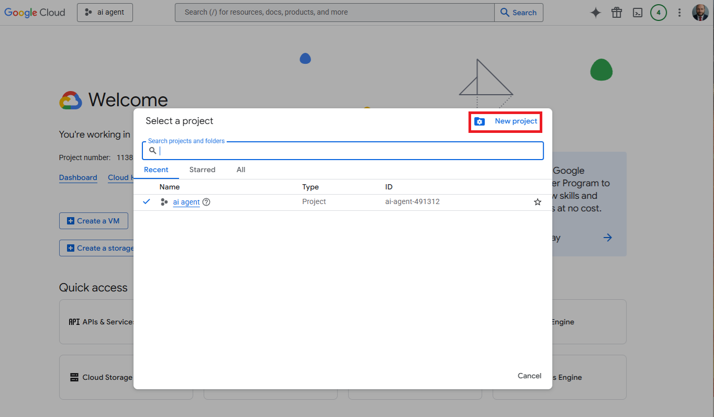

### 2. Enable the Required APIs

The integration needs access to two Google APIs: Gmail API and Calendar API. Enable them in your project.

- In the Cloud Console left menu, navigate to **APIs & Services → Library**
- Search for **Gmail API** → click it → click **Enable**
- Return to the Library and search for **Google Calendar API** → click it → click **Enable**

In the Cloud Console left menu, navigate to **APIs & Services → Library**. The library is the catalog of all Google Cloud APIs, each with its own documentation, pricing details, and quota information. Search for **Gmail API** and click the result. You will see a detailed page describing the API's capabilities, usage limits, and costs. Click **Enable** to activate it for your project. Repeat for **Google Calendar API**.

Enabling an API does two things: it allows your project to make requests to that API using credentials from the project, and it makes the API visible in your project's dashboard for monitoring usage. When you call the API using OAuth credentials from this project, Google checks that the API is enabled; if not, you receive an error. The enablement step essentially registers your intent to use the service.

> **Note:** If your agent only needs email functionality, you can skip Calendar API. However, for full OpenCode capabilities, enable both.

The decision about which APIs to enable should be guided by the principle of least privilege. Request only the access your application truly needs. If you will only send and read emails, you could potentially use a more restrictive OAuth scope than the full Gmail access. However, the integration described here uses the `https://mail.google.com/` scope, which grants comprehensive Gmail access. This simplifies development and ensures the agent can perform any email-related task, but it also requires careful credential protection. For production use cases with specific requirements, narrower scopes may be appropriate.

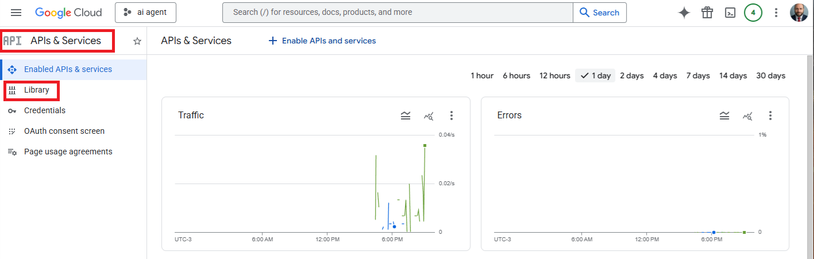
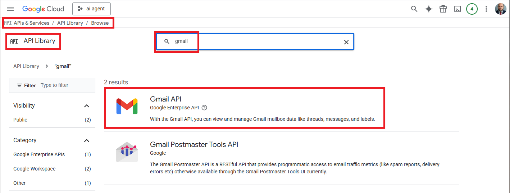

### 3. Configure the OAuth Consent Screen

Google requires you to configure an OAuth consent screen that users see when granting permissions. This step defines what your application is and who can use it. The consent screen builds trust and informs users about the access they are providing.

In the Cloud Console left menu, go to **APIs & Services → OAuth consent screen**. You will choose between **External** and **Internal**. External means anyone with a Google account can request access, but the app must go through verification if you want it publicly available. Internal restricts usage to users within your Google Workspace organization. For OpenCode agents that operate within your own account or a small team, External is fine, but you must add test users explicitly while the app remains in testing mode.

Fill in the required fields:

- **App name**: This appears on the consent screen and in users' Google Account permissions pages. Choose something recognizable and descriptive. "OpenCode AI Agent" clearly indicates the connection to the OpenCode system.
- **User support email**: The address users can contact if they have questions or issues. This should be monitored.
- **Developer contact email**: Your email for Google communications about the app. May be the same as support email.

Under **Test users**, add the Gmail address(es) that will be using this application. This is crucial: only test users can authenticate while the app is in testing mode. If you attempt to sign in with an account not listed here, Google will block the OAuth flow. This restriction limits exposure during development and is required until the app passes verification or is published internally. Add every email address that will run the OpenCode agent.

The consent screen also asks you to specify the scopes your application will request. You can add these manually, but they will be added automatically during the first OAuth flow when the application requests them. The advantage of pre-declaring is that the consent screen shows users in advance what permissions to expect. For simplicity, you can skip this during initial setup and let the first run populate the scopes.

Click **Save and Continue** through the remaining screens. You may encounter sections for additional configuration like logo upload, privacy policy URL, and terms of service URL. These are required for apps seeking verification or public use but are optional for internal testing. You can leave them blank for now.

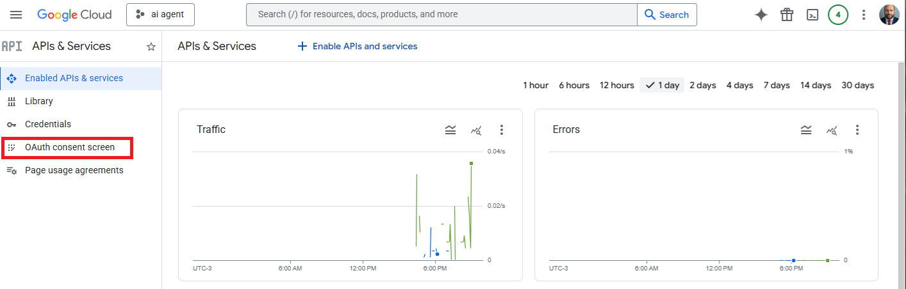
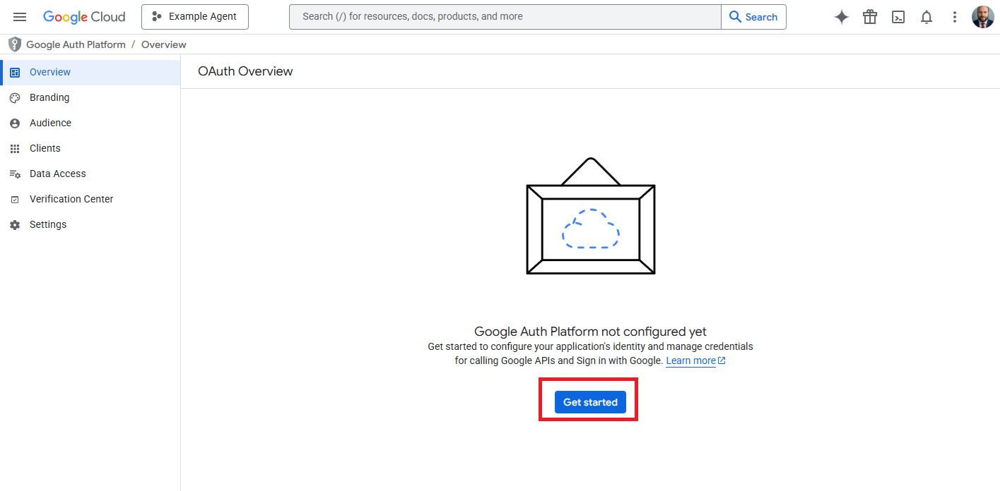

### 4. Create OAuth 2.0 Credentials

Now create the credentials file that your application will use to authenticate with Google.

In the Cloud Console left menu, go to **APIs & Services → Credentials**. This page lists all credential objects in your project: OAuth client IDs, service account keys, API keys. Click **Create Credentials** and select **OAuth client ID**. You will choose an application type; select **Desktop app**. This type is intended for applications running on a user's computer that can open a browser for interactive authentication. It is appropriate for OpenCode agents that will run under your user account.

Give it a name like "OpenCode Desktop Client". The name helps you identify the credential later if you have multiple ones. Click **Create**. Google generates a client ID and client secret, which together identify your application during the OAuth flow. A dialog appears displaying these values and offering a **Download JSON** button. Click it to download a configuration file.

Save the downloaded file as `google_credentials.json` in the `credentials/` directory of your project. The filename and location are important: the scripts and library look for credentials at that exact path. If you place it elsewhere, you will need to adjust code or environment variables. The directory must exist; create it if necessary.

> **Important:** This JSON file contains your client secrets. Never commit it to version control or share it publicly. The client secret allows anyone who possesses it to initiate OAuth flows for your project and potentially obtain tokens for users who consent. While the damage is limited by the test user list while the app is unpublished, it remains sensitive. Add `credentials/` to your `.gitignore` file without delay.

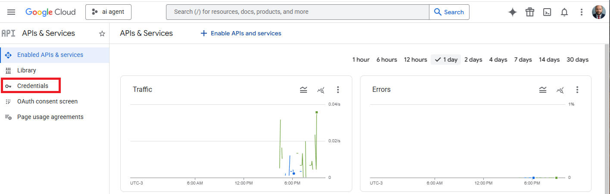
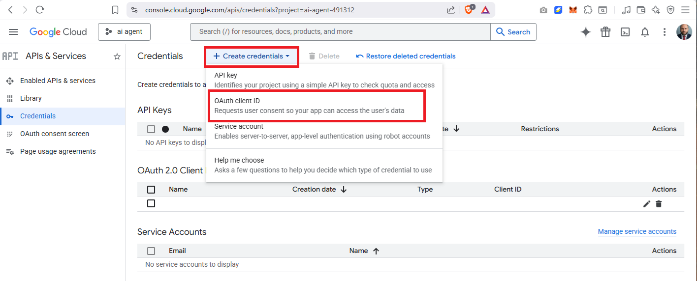

### 5. Publish Your App (Critical for Agents)

If you're building an autonomous agent that needs to run without manual re-authentication, you MUST publish your OAuth app. Otherwise, refresh tokens expire after 7 days, breaking long-running agents.

Return to **APIs & Services → OAuth consent screen**. At the top of the page, you should see a toggle or button labeled **Publish App** (the exact wording may vary). Click it. Google displays a warning explaining that publishing makes the app available to all test users permanently and that refresh tokens will not expire. This is precisely what you want for an autonomous agent. Read the warning and click **Confirm** if you understand.

After publishing, refresh tokens remain valid indefinitely (or until revoked), allowing your agent to run continuously without human intervention. The seven-day limit applies only to unpublished apps in testing mode as a security measure to prevent unauthorized long-term access. Publishing signals that you have configured the app appropriately and understand the implications.

Note that publishing does not remove the test user restriction unless your app also passes verification. If you are using an External app, only users on the test user list can authenticate, even after publishing. To allow any Google account to use the agent, you would need to submit the app for verification, which requires demonstrating compliance with Google's policies, providing a privacy policy, and possibly a security assessment. For most OpenCode use cases where the agent runs under your own account or within a known team, the test user model suffices. Simply add all intended users to the test list before publishing.

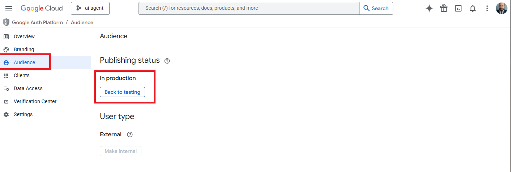

### 6. Obtain a Refresh Token

Before your agent can use the Google APIs, you need to authenticate once and obtain a refresh token. This token allows your application to get new access tokens automatically without requiring you to log in every time.

Run the following Python script once to authenticate and generate the token file:

```python
import os.path
from google.auth.transport.requests import Request
from google.oauth2.credentials import Credentials
from google_auth_oauthlib.flow import InstalledAppFlow
from googleapiclient.discovery import build
from googleapiclient.errors import HttpError

# Scopes define what permissions your app requests
# Full access is recommended for AI agents
SCOPES = ['https://mail.google.com/']

def main():
    """Authenticate and save refresh token to credentials/token.json"""
    creds = None

    # If token already exists, load it
    if os.path.exists('credentials/token.json'):
        creds = Credentials.from_authorized_user_file('credentials/token.json', SCOPES)

    # If no valid credentials, run the OAuth flow
    if not creds or not creds.valid:
        if creds and creds.expired and creds.refresh_token:
            # Refresh expired token automatically
            creds.refresh(Request())
        else:
            # First-time authentication: opens browser for user consent
            flow = InstalledAppFlow.from_client_secrets_file(
                'credentials/google_credentials.json', SCOPES)
            creds = flow.run_local_server(port=8080)

        # Save credentials (including refresh token) for future use
        os.makedirs('credentials', exist_ok=True)
        with open('credentials/token.json', 'w') as token:
            token.write(creds.to_json())

        print("[SUCCESS] Authentication complete!")
        print("Token saved to credentials/token.json")
        print("Your agent can now use this token indefinitely.")

if __name__ == '__main__':
    main()
```

**What this script does, step by step:**

The script orchestrates the OAuth 2.0 authorization code flow, transforming the initial user consent into a persistent refresh token that can be reused indefinitely. Understanding this flow is essential for any integration with Google APIs or similar services. Let us examine each phase in detail.

The script begins by defining `SCOPES`, a list of permission strings that specify what the application intends to do. The scope `https://mail.google.com/` is one of the predefined scopes for Gmail and represents the broadest possible access, allowing the application to read, send, delete, and manage all email. For calendar operations, you would add `https://www.googleapis.com/auth/calendar`. Scopes serve as the user's consent boundary: when the user approves the OAuth flow, they are explicitly granting these permissions. An application cannot exceed its granted scopes, and the consent screen lists them so users know what they are authorizing.

The `main()` function implements a state machine for credential management. The variable `creds` starts as `None` and may be populated by loading an existing token file. The check `if os.path.exists('credentials/token.json')` looks for a previously saved credential. If found, `Credentials.from_authorized_user_file()` parses the JSON, reconstructing credential objects with their associated access token, refresh token, expiry time, and scopes. This loaded credential may be in one of three states: valid (access token still fresh), expired but with a refresh token (can be renewed), or invalid for some other reason (missing fields, revoked, etc.).

The conditional `if not creds or not creds.valid:` determines whether authentication is needed. When no credentials exist or the existing ones are not valid, the flow proceeds to obtain new credentials. The nested condition `if creds and creds.expired and creds.refresh_token:` handles the common case where the saved credential has expired but carries a refresh token. The `creds.refresh(Request())` call contacts Google's token endpoint, presenting the refresh token to obtain a new access token. This operation is silent; it does not require browser interaction because the refresh token proves previous user consent. The refresh typically succeeds if the refresh token remains valid (i.e., not revoked, not expired due to inactivity in testing mode). If the refresh succeeds, `creds` now contains a fresh access token and a new expiry time.

If the refresh path fails or no credential exists at all, the execution falls to the `else` branch that initiates the full OAuth flow. `InstalledAppFlow.from_client_secrets_file()` reads the client ID and client secret from the downloaded JSON credentials. These uniquely identify the application to Google's OAuth server. The `run_local_server(port=8080)` method constructs an authorization URL and opens the user's default browser to that URL. The user then signs in with their Google account, if not already signed in, and sees a consent screen listing the requested scopes and the app name. Upon clicking "Allow," Google redirects the browser to a local URL on port 8080 with an authorization code in the query parameters.

The local server started by `run_local_server` listens on that port, receives the redirect, extracts the authorization code, and exchanges it for tokens by making a backend request to Google's token endpoint. The response includes an access token (short-lived), a refresh token (long-lived), token type, and expiry. The `creds` object is populated with these values. At this point, user interaction is complete.

The final part of the conditional block saves the credentials to `credentials/token.json` for future use. The `os.makedirs('credentials', exist_ok=True)` ensures the target directory exists. The `to_json()` method serializes the credential object into a JSON structure that includes all necessary fields. Writing this file atomically preserves the token. Subsequent runs will find this file and attempt to load from it, avoiding repeated browser flows.

The print statements provide user feedback: a success message, the file location, and reassurance that the agent can now use the token indefinitely. This last note refers to the fact that once the app is published, the refresh token does not expire. However, if the user revokes the app's access from their Google Account security settings, or if the credentials are deleted from the Google Cloud Console, the refresh token becomes invalid and the script will need to be run again.

**Important notes:**

The script as written requests only the Gmail scope. If you need calendar functionality as well, modify the `SCOPES` line to:
```python
SCOPES = ['https://mail.google.com/', 'https://www.googleapis.com/auth/calendar']
```
Both scopes can be requested in a single OAuth flow, and the resulting token will authorize both APIs. The token file remains valid for all granted scopes.

The refresh mechanism relies on the `google.auth.transport.requests.Request()` object, which provides an HTTP transport layer for token refresh. This detail is abstracted away by the higher-level `creds.refresh()` call, but understanding that a network request occurs during refresh is helpful for debugging network-related failures.

The local server uses port 8080 by default. If that port is unavailable, you can specify a different port: `flow.run_local_server(port=0)` automatically selects an available port, or choose a specific number. The redirect URI registered for desktop apps includes both `http://localhost:8080` and `http://localhost:0`, so any ephemeral port works.

For headless environments without a browser, the flow can use the console method: `flow.run_console()` instead of `run_local_server()`. This prints a URL to the console that the user must copy into a separate browser session, then paste the resulting authorization code back. This is useful for servers or remote machines, though less convenient.

The script does not handle all possible exceptions. In production code, you would wrap the flow and refresh calls in try-except blocks to catch `HttpError`, `RefreshError`, and other exceptions, providing user-friendly error messages and possibly suggesting recovery actions. The current script is sufficient for initial setup.

**Security considerations:**

The token file contains refresh tokens that can be used to obtain access tokens acting as the user. Protect this file with filesystem permissions that restrict access to the running user. Do not share it or back it up to insecure locations. If compromised, delete the file immediately and revoke the app's access from the Google account security page.

The token file persists beyond the script execution. This persistence is what enables autonomy: subsequent invocations of any Google skill can load the token and operate without user presence. For this reason, securing the credential directory is paramount.

**What the token contains:**

The token JSON typically includes:
- `token`: The access token (short-lived, changes with each refresh)
- `refresh_token`: The refresh token (stable until revoked)
- `token_uri`: Google's token endpoint
- `client_id` and `client_secret`: Your app's identity
- `scopes`: List of granted scopes
- `expiry`: Access token expiration time

The refresh token is the valuable part for long-running agents. Access tokens are discarded after use; they are fetched fresh from the refresh token when needed.

**Troubleshooting common issues:**

- If the browser fails to open, check that your environment has a default browser and that `webbrowser` module can access it. You may need to set the `BROWSER` environment variable or use the console flow.
- If the local server cannot bind to port 8080, either free the port or choose another: `flow.run_local_server(port=0)` for automatic selection.
- If you see `invalid_grant` errors during refresh, your refresh token may have expired (in testing mode after 7 days) or been revoked. Delete `token.json` and re-run the script.
- If the consent screen does not list the expected scopes, check the `SCOPES` variable before running the flow. Scopes requested after the first authorization may require user re-consent.
- If the token file is not created, check permissions on the `credentials` directory. The script attempts to create it with default permissions.

The script embodies the principle of single responsibility: its sole purpose is to obtain and save a refresh token. It does not provide functions for using the credentials; those reside in `google_operations.py`. This separation keeps the initialization logic isolated from operational logic.

After running this script successfully, the file `credentials/google_token.json` will exist, and the various skills and scripts will be able to authenticate automatically without further user interaction. This single execution marks the transition from manual setup to autonomous operation.

### 7. Integrate with Your Agent

The `google_operations.py` library (located in `libs/google_operations.py`) provides ready-to-use functions that your agent can call directly.

At the top of the file, configure these constants:

```python
SENDER_NAME = "Augustus Machine"  # Name that appears in sent emails
SIGNATURE_HTML_FILE = "resources/signature.html"  # HTML signature path
```

**Basic usage example:**

```python
import sys
import os
sys.path.insert(0, os.path.join(os.path.dirname(__file__), '..', 'libs'))

from google_operations import (
    get_gmail_service,
    send_email,
    list_unread_emails,
    get_email_content,
    reply_email,
    get_calendar_service,
    create_event
)

# Gmail service is auto-initialized with token authentication
gmail = get_gmail_service()

# Send an email
send_email(
    to="recipient@example.com",
    subject="Hello from OpenCode",
    body="This is a test email sent via the Google integration."
)

# List unread emails
unread = list_unread_emails(max_results=10)
for email in unread:
    print(f"From: {email['from']}")
    print(f"Subject: {email['subject']}")

# Create a calendar event
from datetime import datetime
event = create_event(
    summary="Team Meeting",
    start_time=datetime(2026, 4, 15, 14, 0, 0),
    end_time=datetime(2026, 4, 15, 15, 0, 0),
    description="Weekly sync discussion",
    attendees=["alice@example.com", "bob@example.com"]
)
print(f"Event created: {event['htmlLink']}")
```

The library handles authentication automatically, just ensure `credentials/token.json` exists. For detailed function documentation, see the library source code or the reference guides in `docs/`.

### Orchestration Patterns: Combining Skills for Autonomous Workflows

The true power of the OpenCode agent system emerges when individual skills are orchestrated into multi-step workflows that can operate with minimal human intervention. The basic usage example shows isolated function calls, but real-world agentic applications chain these calls together, using intermediate results to guide subsequent actions. Understanding these orchestration patterns is essential for leveraging the full potential of the architecture.

Consider the **email-to-calendar** workflow that appears throughout this documentation. This pattern transforms an incoming booking request into a scheduled event through a sequence of coordinated steps. The agent begins by identifying relevant emails, possibly using `list_unread_emails()` or `search_emails()` with a query derived from the user's request. Once candidate messages are located, the agent retrieves full content with `get_email_content()` and parses it to extract structured data: event title, proposed times, attendee email addresses, location, and any special instructions.

The extraction step represents a cognitive process where the agent interprets unstructured text. This is not a simple template match but genuine understanding: the agent must recognize dates and times expressed in various formats, identify people from context, and infer the event's purpose. Errors in extraction can propagate to later steps, so the agent typically performs validation, checking that required fields are present, that times are in the future, that attendee addresses are well-formed. If validation fails, the agent can either ask the user for clarification or make reasonable assumptions while indicating uncertainty.

With validated data in hand, the agent proceeds to calendar creation. The `create_event()` function becomes the execution point for this orchestrated workflow. The agent constructs the event object, mapping extracted fields to parameters: summary from the event title, start and end times parsed from the email, attendees from the identified email addresses, description including any relevant details. If attendees are specified, Google Calendar automatically sends invitations to those addresses. The agent might also check for calendar conflicts before creating the event, though that capability would require an additional skill or library function not shown in the basic integration.

Once the event is created, the agent can perform follow-up actions: notifying the requester via email that the booking succeeded, perhaps including the event link; adding the event to a shared project calendar; or posting a message to a team chat channel. Each of these actions would invoke other skills, making the email-to-calendar workflow a node in a larger orchestration graph.

A different pattern is demonstrated by the **intelligent reply agent**. Here the agent operates in a monitoring loop: periodically or on trigger, it calls `list_unread_emails()` to check for new messages. It then analyzes each message's content to determine whether a response is warranted, what tone to use, and what information to include. This analysis may involve the agent's own reasoning capabilities rather than invoking external skills. Once a response is formulated, the agent uses `reply_email()` with the composed body, ensuring proper threading by passing the original message's ID.

The reply workflow includes important safety checks. The agent should verify that the email truly requires a response, perhaps it's a notification that can be ignored, or a message already handled by another agent. The agent should avoid sending inappropriate or out-of-scope content, which might be guided by system prompts or content filters. When in doubt, the agent can ask for human confirmation before sending, especially for responses that could have significant consequences.

These patterns share a common structure: **sense-reason-act**. The agent senses the environment by calling skills that retrieve data (`list_unread_emails`, `get_email_content`, `list_events`). It reasons about that data to decide what to do next, using its language model capabilities to interpret, plan, and generate. It acts by calling skills that modify state (`send_email`, `create_event`, `reply_email`). This loop may iterate multiple times as the agent gathers more information or executes complex tasks.

The skill-based architecture enables this orchestration because each skill has a clear, narrowly defined purpose and predictable behavior. The agent does not need to know how Gmail authentication works or how to parse MIME messages; it simply knows that `get_email_content(message_id)` returns the email body. This abstraction allows the agent to work at the level of intentions rather than implementation details.

Another orchestration pattern is **parallel branching**, where an agent calls multiple independent skills and combines their results. For example, before scheduling a meeting, the agent might simultaneously check the availability of multiple participants by querying their calendars, then aggregate the free slots to propose meeting times. While the current Google integration does not expose a direct "check availability" function, one could be built using `list_events()` to examine existing bookings. The agent would invoke that function for each participant's calendar, potentially in parallel if the system supports concurrent calls, then analyze the returned event lists to identify common free periods.

A related pattern is **conditional routing**, where the agent's next action depends on the outcome of a previous skill. After attempting to send an email, the agent might check the return value or catch exceptions. On success, it proceeds to the next step; on failure, it may retry, log the error, or alert a human. Conditional logic allows orchestrations to be resilient to failures and adapt to changing circumstances.

When designing orchestrated workflows, it is helpful to think in terms of **states and transitions**. Each skill call moves the workflow from one state to another, with the state including both data (what information has been gathered) and context (what the agent is trying to accomplish). States may be represented explicitly using variables, or implicitly in the agent's conversation history. Understanding the possible states and how to transition between them is key to constructing robust orchestrations.

The **error handling** aspect deserves special attention. Skills can fail for many reasons: network issues, API rate limits, authentication problems, invalid parameters, insufficient permissions, or service outages. A well-designed orchestration anticipates these failure modes and provides fallback behavior. For instance, if `create_event()` fails due to a conflict at the requested time, the agent might propose alternative times extracted from the original email or ask the user for a different slot. If `send_email()` fails because the recipient address is invalid, the agent might correct the address by consulting previous correspondence or notify the user to verify the contact.

In the OpenCode system, these orchestrations can be implemented in different ways. They may be **prompted** through natural language instructions to an agent that has the relevant skills available; the agent's own reasoning determines the step sequence. They may be **coded** explicitly in Python that calls the library functions in a predetermined order, with explicit conditionals and loops. They may be **hybrid**, where a high-level plan is generated by an agent and then executed by a runner that invokes skills according to the plan.

## Core Architecture: The google_operations Library

At the heart of all Google-related functionality is `google_operations.py`, a Python library located in `libs/google_operations.py`. This library handles the complex authentication and API interactions, providing clean functions that the command line tools call.

### Authentication Flow

The library uses OAuth 2.0, the same secure authentication method used by many web applications. When you first run any of the tools, the system opens your browser to ask for permission to access your Google account. Once you approve, a token is saved locally and automatically refreshed when needed, so you rarely need to re-authenticate.

The authentication system caches credentials in `credentials/google_token.json` and uses the client secrets from `credentials/google_credentials.json`. Both files must exist for the tools to work.

### Configuration Options

Two constants at the top of `google_operations.py` control the email experience:

```python
SENDER_NAME = "Augustus Machine"
SIGNATURE_HTML_FILE = "resources/signature.html"
```

The `SENDER_NAME` appears in the From header of sent emails. The `SIGNATURE_HTML_FILE` points to an HTML file that gets automatically appended to every email sent through the system.

### Authentication Service Functions

The library provides two service getter functions that handle authentication automatically:

- `get_gmail_service()` - Returns an authenticated Gmail API service
- `get_calendar_service()` - Returns an authenticated Calendar API service

Both functions check for existing tokens, refresh expired tokens automatically, and trigger the OAuth flow only when necessary. This means once you authenticate, the tools work seamlessly in scripts and automation without manual intervention.

## Email Operations

The system provides three distinct email functions, each serving a specific purpose. Together they cover the complete email lifecycle: sending new messages, monitoring incoming mail, and participating in conversations through replies. These functions form a toolkit that agents can use to manage email communication autonomously.

### Sending Emails (send_email)

The `send_email()` function creates and sends new email messages. It accepts a recipient, subject, and body content, and optionally CC recipients.

```python
def send_email(to, subject, body_html, cc=None):
    """Send an email as HTML only with HTML signature"""
```

The function signature reveals several design choices. The `body_html` parameter name suggests HTML input, but in practice the function accepts plain text and performs automatic conversion. This interface design keeps the callers simple while the function handles HTML generation internally. The `to` and `cc` parameters are strings, not lists, which aligns with typical email addressing where multiple recipients are comma-separated.

The function has an important design decision: all emails are sent exclusively in HTML format. The body you provide is plain text that gets automatically converted to HTML. This conversion handles paragraphs and line breaks intelligently.

**HTML Conversion Rules:**

The conversion process works as follows:
- Blank lines (two consecutive newlines) create separate paragraphs wrapped in `<p>` tags
- Single newlines within a paragraph become `<br />` tags
- Special HTML characters are escaped to prevent injection
- UTF-8 encoding ensures international characters work properly
- The configured HTML signature is automatically appended

This conversion algorithm mirrors how many text editors treat line breaks. Two consecutive newlines indicate a paragraph break, while a single newline within text indicates a line break without starting a new paragraph. This approach allows users to format emails naturally without needing HTML knowledge.

For example, this input:

```
Hello Team,

Project update:
- Phase 1: Complete
- Phase 2: In progress

Review the documents.

Best regards,
Manager
```

Becomes this HTML:

```html
<div style="font-family: Arial, sans-serif; font-size: 14px; line-height: 1.5;">
<p>Hello Team,</p>
<p>Project update:<br />
- Phase 1: Complete<br />
- Phase 2: In progress</p>
<p>Review the documents.</p>
<p>Best regards,<br />
Manager</p>
</div>
```

The HTML output includes a wrapping `<div>` with sensible default styles inherited from the signature HTML file. The actual signature content is appended after your body. If you examine the signature file, you will find it contains similar styling along with your name, title, and contact information.

This HTML-only approach ensures consistent formatting across email clients but means recipients without HTML capability will see blank content. In the current era, virtually all email clients support HTML, so this limitation is acceptable for most use cases. However, if you anticipate recipients using plain-text-only clients, you would need to modify the function to send multipart messages with both plain text and HTML alternatives.

**Orchestration Example: Automated Status Reports**

Consider an orchestration where an agent automatically sends daily status reports to management. The agent might:
1. Gather data from various sources (code commits, build status, issue tracking)
2. Format a summary email body using plain text with clear sections
3. Call `send_email()` with the composed body, relying on automatic HTML conversion
4. Handle any sending failures by logging and retrying or escalating

The automatic HTML conversion means the agent can generate content in a natural text format without needing to produce HTML markup. The styling comes from the signature, ensuring consistent branding.

**Error Handling in Sending**

The `send_email()` function returns the message ID on success or `None` on failure. Possible failure reasons include:
- Invalid recipient address format (though the function does not strictly validate)
- Authentication failure (token expired or missing)
- Network errors or API quota exceeded
- Insufficient permissions

Agents using this function should check the return value and implement appropriate fallback behavior. For critical notifications, a failed send might trigger alternative notification channels or alert a human operator.

### Reading Emails (list_unread_emails and get_email_content)

Two functions handle email reading, each serving a different purpose in the orchestration toolkit.

```python
def list_unread_emails(max_results=10):
    """Returns list of unread emails (subject, sender, snippet, id)"""
```

```python
def get_email_content(message_id):
    """Get full email: subject, from, body (plain text)"""
```

The `list_unread_emails()` function uses Gmail's UNREAD label to find messages that haven't been marked as read. It returns a list of dictionaries containing the message ID, sender, subject, and a snippet of the body. This is useful for checking what emails are waiting without retrieving full content.

The return structure looks like:
```python
[
    {
        'id': '17c3a5b6f7e8a9b0c1d2e3f4',
        'from': 'alice@example.com',
        'subject': 'Project Update',
        'snippet': 'Here is the latest progress on the initiative...'
    },
    # more messages...
]
```

The `snippet` is a short preview, typically the first few lines of the email body truncated to a reasonable length. Gmail generates this automatically and it is useful for quick scanning without full retrieval. The `id` is the unique Gmail message identifier needed to fetch the full content.

The `max_results` parameter limits the number of unread emails returned. The default is 10, which is sensible for interactive use where an agent will process each email. For batch processing, you might increase this limit, but be aware of API quotas and memory usage. The function internally adds the Gmail query `is:unread` to restrict results.

The `get_email_content(message_id)` function retrieves the complete email including headers and body. It extracts plain text content from MIME parts and truncates to 2000 characters for safety. This prevents memory issues with very long emails.

The return structure includes:
- `subject`: The email subject line
- `from`: The sender's email address and possibly name
- `body`: The plain text body content (up to 2000 characters)

MIME complexity is abstracted away. Emails with HTML bodies, attachments, or multipart structures are converted to plain text. This is appropriate for an agent that needs to understand content but not reproduce formatting. If HTML content is needed, the library could be extended to return it, but the current design prioritizes simplicity.

**Orchestration Pattern: Monitoring Inbox**

A common pattern is an agent that monitors unread emails and dispatches them to appropriate handlers. The agent would:
1. Call `list_unread_emails(max_results=50)` to get a batch of unread messages
2. For each message, decide whether it requires a response based on subject, sender, and snippet
3. For those needing action, call `get_email_content(message_id)` to obtain full context
4. Process the content and potentially invoke `reply_email()` or other skills
5. Mark the email as read (if needed) or let it remain unread until next cycle

Marking as read is not directly exposed in the library but can be done by modifying message labels via the Gmail API if needed. The default behavior of many agents is to leave emails unread until they have been fully processed, allowing for manual review or re-processing if necessary.

**Error Handling in Reading**

`list_unread_emails()` returns an empty list on failure or if no unread emails exist. Distinguishing between these cases requires checking API response codes, which the library abstracts. For most orchestration purposes, an empty list simply means nothing to do, whether due to no unread mail or a temporary failure. If differentiating matters, one could enhance the library to return error information.

`get_email_content()` returns `None` if the fetch fails, such as when the message ID is invalid or the message no longer exists (e.g., deleted by another process). The calling agent should handle this gracefully, perhaps logging the issue and skipping that message.

### Replying to Emails (reply_email)

The `reply_email()` function handles responses to existing threads while maintaining proper email conversation structure. This is more complex than sending a new email because the reply must be correctly linked to the original message to preserve threading.

```python
def reply_email(message_id, body_html, cc=None):
    """Reply to an existing email thread using Gmail API"""
```

When you reply to an email, threading is critical. The function automatically:
- Fetches the original message to extract headers
- Sets the `In-Reply-To` header to the original message's Message-ID
- Sets the `References` header to establish the conversation chain
- Uses the `threadId` parameter when sending so Gmail groups it correctly
- Preserves the original subject without adding "Re:" (Gmail handles this)
- Sets the recipient to the original sender

Email threading is governed by RFC 5322 standards. The `Message-ID` header uniquely identifies each email. When a reply includes `In-Reply-To` set to the original's Message-ID, and optionally `References` listing ancestral Message-IDs, email clients can group messages into conversations. The `threadId` in Gmail's API provides a more robust grouping that aligns with Gmail's conversation view.

The `reply_email()` function handles all this complexity internally. The caller only needs to provide the original message's ID (obtained from `list_unread_emails()` or elsewhere) and the reply body. The body follows the same HTML conversion rules as `send_email()`, with automatic signature appending.

**Orchestration Example: Handling Inquiries**

An agent tasked with responding to customer inquiries might:
1. Poll `list_unread_emails()` filtered to a support address
2. Use the `snippet` to determine if the email is a new inquiry or a follow-up
3. Fetch the full content with `get_email_content()`
4. Analyze the inquiry to extract the question or problem
5. Generate an appropriate response based on knowledge or by consulting other systems
6. Call `reply_email()` with the composed response
7. Optionally log the interaction or update a ticket system

The automatic threading ensures the response appears in the correct conversation, which is crucial for maintaining context in email exchanges. The agent does not need to worry about threading mechanics; it simply specifies which message is being replied to.

**Advanced Threading Considerations**

Some email conversations involve multiple recipients and complex reply patterns. The basic `reply_email()` function sends the reply to the original sender only. If you need to reply to all original recipients, you would need to extract the recipient list from the original message headers and use `send_email()` with an appropriate `To` or `CC` header rather than `reply_email()`. This is a limitation of the current implementation that could be addressed by adding a `reply_all` parameter.

Another nuance is the `cc` parameter in `reply_email()`. This adds additional recipients beyond the original sender. This could be used to include a manager on certain replies or to loop in a team distribution list. The caller must provide explicit addresses; the function does not inherit CC recipients from the original message.

**Error Handling in Replies**

Failures in `reply_email()` generally mirror those in `send_email()`: authentication issues, network errors, invalid message ID, etc. The function returns the new message ID on success or `None` on failure. An agent might retry transient failures, but must beware of accidentally sending duplicate replies. Including a unique identifier in the response body or tracking sent replies in a state store can prevent duplicates.

### Orchestrating Email Operations Together

The three email functions can be combined into sophisticated automations. For example, an agent that "triage my inbox" might:

1. List all unread emails
2. Categorize them by sender and subject keywords
3. For urgent requests from VIPs, send an immediate acknowledgment reply
4. For routine notifications, mark as read without response
5. For questions requiring information, search the knowledge base and reply with answers
6. For spam, delete or archive (if that function were made available)

Each category involves different combinations of reading and sending functions. The agent's decision logic determines which path each email takes.

Another example: "Follow up on sent proposals." The agent could:
1. Search for emails sent with a proposal attachment in the last week
2. Check for replies from recipients
3. If no reply, send a polite follow-up
4. Track follow-up dates to avoid spamming

This would use `search_emails()` (not exposed in CLI but available in library) to find the sent messages, then `list_unread_emails()` or `get_email_content()` to check for replies, then `send_email()` or `reply_email()` for follow-up.

These patterns demonstrate how discrete skills compose into meaningful autonomous behavior. The agent acts as the conductor, calling appropriate functions at the right time based on data gathered from previous calls.

## Calendar Operations

The library includes five calendar management functions that together provide full CRUD capabilities plus listing and search. Calendar operations complement email functions, enabling agents to manage scheduling and time coordination.

### Listing Calendars (list_calendars)

```python
def list_calendars():
    """Returns list of calendars accessible to the user"""
```

Returns all calendars you have access to, including shared calendars. Each calendar object includes its ID, summary, description, whether it's primary, and access role.

The primary calendar (usually named after the user's email address) has `primary` as its ID, which is a special value accepted by other functions to refer to that calendar. Secondary calendars, such as shared team calendars or specialty calendars (holidays, birthdays), have opaque IDs that must be obtained through this listing function.

The access role indicates what actions the authenticated user can perform on that calendar: `owner` can modify sharing and delete, `writer` can create and edit events, `reader` can only view events. The library functions will enforce these permissions through API errors if you attempt unauthorized actions.

**Orchestration Pattern: Calendar Discovery**

An agent that needs to interact with shared calendars should first call `list_calendars()` to discover available options. For example, if asked to "schedule the team meeting," the agent might:
1. List calendars to find one named "Team Calendar" or similar
2. Use that calendar's ID for the event creation
3. If no appropriate calendar is found, fall back to primary or ask the user

This pattern of discovery before action makes agents more robust to changing environments where calendars may be added or removed.

### Creating Events (create_event)

```python
def create_event(calendar_id='primary', summary=None, start_time=None, end_time=None,
                 description=None, location=None, attendees=None, **kwargs):
```

This is the most feature-rich function. It accepts required parameters (summary, start_time, end_time) and many optional ones. The function automatically converts datetime objects to ISO format and supports additional event properties through `**kwargs`.

**Key Parameters:**

The `summary` is the event title. It should be concise yet descriptive, typically under 100 characters for optimal display in calendar interfaces.

The `start_time` and `end_time` can be datetime objects or ISO format strings. When using datetime objects, the timezone is inferred from the object's tzinfo attribute. Naive datetime objects (without timezone) are treated as UTC by default, which may cause confusion. For clarity, use timezone-aware datetimes or ISO strings with timezone offsets.

```python
from datetime import datetime
import pytz

# Timezone-aware datetime
santiago_tz = pytz.timezone('America/Santiago')
start = santiago_tz.localize(datetime(2026, 4, 15, 14, 0, 0))

# Or ISO string with timezone
start = '2026-04-15T14:00:00-04:00'
```

The `description` supports HTML formatting for rich event details. This allows links, emphasis, and lists in the event body that appears when attendees click the event in Google Calendar. The HTML should be simple; complex layouts may not render well in the calendar interface.

The `location` can be a physical address or virtual meeting link. If you are creating events with Google Meet video conferencing, include the conference link here, or use the `conferenceData` parameter to have Google generate it automatically.

The `attendees` parameter takes a list of email addresses, which the function converts to the proper API format. Each attendee can also be specified as a dictionary with `email`, `displayName`, and optionally `responseStatus`. The simple list form is sufficient for most cases.

**Additional Properties via `**kwargs`:**

The function accepts any additional event properties recognized by the Google Calendar API. This extensibility allows advanced use cases without changing the function signature.

The `recurrence` parameter accepts RRULE strings that define repeating patterns. This is one of the most powerful features for managing series events. The syntax follows the iCalendar standard (RFC 5545). Common patterns include:

```python
# Daily for 10 occurrences
recurrence=['RRULE:FREQ=DAILY;COUNT=10']

# Every Monday and Wednesday until a specific date
recurrence=['RRULE:FREQ=WEEKLY;BYDAY=MO,WE;UNTIL=20250430']

# Every 2 weeks on Friday
recurrence=['RRULE:FREQ=WEEKLY;INTERVAL=2;BYDAY=FR']

# Monthly on the 15th
recurrence=['RRULE:FREQ=MONTHLY;BYMONTHDAY=15']

# Every weekday (Monday through Friday)
recurrence=['RRULE:FREQ=DAILY;BYDAY=MO,TU,WE,TH,FR']
```

The `reminders` parameter configures notification settings. It accepts a list of reminder objects with `method` (email, popup, sms) and `minutes` before the event. Example:

```python
reminders=[
    {'method': 'email', 'minutes': 60},
    {'method': 'popup', 'minutes': 15}
]
```

The `colorId` assigns one of eleven predefined colors to the event when displayed in calendar views. Color helps organize events by category or priority. The color mapping is:

| colorId | Color Name | Hex Code |
|---------|------------|----------|
| 1 | Lavender | #a4bdfc |
| 2 | Sage | #7ae7bf |
| 3 | Grape | #dbadff |
| 4 | Flamingo | #ff887c |
| 5 | Banana | #fbd75b |
| 6 | Tangerine | #ffb878 |
| 7 | Peacock | #46d6b6 |
| 8 | Graphite | #5484ed |
| 9 | Blue | #51b749 |
| 10 | Navy | #dc2127 |
| 11 | Red | #fff8b1 |

The `transparency` parameter determines whether the event blocks time. `opaque` (the default) marks the time as busy. `transparent` indicates the event does not block time, useful for events like "Out of Office" that should not prevent scheduling overlaps.

The `visibility` parameter controls who can see event details: `default` follows the calendar's default, `public` shows full details to anyone with access, `private` hides details showing only "Busy", `confidential` is similar to private but may show as busy to some users.

The `conferenceData` parameter creates Google Meet video conference links. The configuration requires a `createRequest` with a unique `requestId` and `conferenceSolutionKey.type` set to `'hangoutsMeet'`. The API then generates a conference link and adds it to the event's `conferenceData` field. The link appears in the event description and in attendee invitations automatically.

```python
conferenceData={
    'createRequest': {
        'requestId': 'unique-request-id-123',  # must be unique per request
        'conferenceSolutionKey': {
            'type': 'hangoutsMeet'
        }
    }
}
```

Guest permissions control what attendees can do:
- `guestsCanInviteOthers`: Whether attendees can invite additional people
- `guestsCanModify`: Whether attendees can change event details
- `guestsCanSeeOtherGuests`: Whether attendees can see the full guest list

Setting these to `False` restricts the event to the explicit guest list and prevents modifications, which is appropriate for sensitive meetings.

Extended properties allow storing custom application data with the event:

```python
extendedProperties={
    'private': {
        'ticketId': 'TICKET-1234',
        'internalCode': 'ABC-567'
    },
    'shared': {
        'project': 'website-redesign',
        'team': 'engineering'
    }
}
```

Private properties are visible only to the calendar owner. Shared properties are visible to all attendees. This distinction is useful for metadata that should be collaborative (shared) versus internal notes (private).

**Orchestration Pattern: Intelligent Scheduling**

The richness of `create_event()` enables complex scheduling workflows. An agent orchestrating a meeting might:

1. Determine the meeting purpose, duration, and preferred attendees
2. List calendars to select an appropriate calendar (team calendar vs personal)
3. Parse proposed times from an email or user request
4. Check for conflicts by calling `list_events()` for each required attendee's calendar (requires access to those calendars)
5. Choose a time with no conflicts, or propose alternatives
6. Create the event with appropriate attendees, description, and possibly video conference
7. Send notifications via the event invitations

The `create_event()` function handles the creation step, but the orchestration around it involves reading multiple calendars, analyzing availability, and handling potential failures (time conflict, attendee limits, permission issues).

### Reading Events (list_events and get_event)

```python
def list_events(calendar_id='primary', time_min=None, time_max=None, max_results=100, q=None):
    """List events from a calendar with optional time range and search query"""
```

```python
def get_event(calendar_id, event_id):
    """Get a specific event by ID"""
```

The `list_events()` function retrieves events within a time range. If no times are provided, it defaults to now through the next 30 days. The `q` parameter allows free text search across event fields. The `singleEvents=True` parameter expands recurring events into individual instances.

Time parameters accept ISO format strings or datetime objects. The API defaults to `singleEvents=True` in practice, so recurring events return as individual occurrences with their specific times. Setting `singleEvents=False` returns the master recurring event definition, which is less useful for checking availability.

The return value is a list of event objects with all properties of each event. These objects can be large, containing many nested fields. Agents extracting specific information should filter the results to needed fields.

The `q` parameter performs a simple text match across event title, description, location, and attendees' names/emails. It is not a full-featured search like Gmail's but is adequate for finding events by partial title or known attendee.

The `get_event()` function fetches a single event by its ID and calendar. The event ID is a string that uniquely identifies the event within that calendar. IDs are returned by `create_event()`, visible in the event's HTML link in Google Calendar, or can be obtained by searching with `list_events()`.

**Orchestration Pattern: Conflict Detection**

Before creating an event, an agent might want to ensure it does not conflict with existing events. The agent could:

1. Call `list_events()` for the target calendar with a time range encompassing the proposed event, plus some buffer
2. Check each returned event's start and end times to see if they overlap with the proposed time
3. If overlap found, either choose a different time or notify the user of the conflict

For multi-attendee meetings, the agent would need to repeat this for each attendee's calendar, requiring access to those calendars. The `list_calendars()` function reveals which calendars are accessible.

### Updating Events (update_event)

```python
def update_event(calendar_id, event_id, **updates):
    """Update an existing event with new properties"""
```

This function retrieves the existing event, applies the updates you provide, and sends the modified event back to the API. It handles datetime conversion automatically for start and end times.

The update is a full replacement of the specified fields, not a patch. You do not need to provide all event fields, only those you wish to change, but the underlying API uses a full update operation. The function handles merging your changes with the existing event on the server side, so you do not need to first fetch and then re-submit all fields.

Be careful with updates that modify time or attendees: such changes may trigger notifications to all attendees. Also, recurring events have special handling for modifying individual instances versus the entire series. The current function does not expose that distinction; a more specialized function would be needed for recurring event modifications.

### Deleting Events (delete_event)

```python
def delete_event(calendar_id, event_id):
    """Delete an event from a calendar"""
```

Removes an event from the calendar. Returns True on success or if the event was already deleted (404 is treated as success). Returns False on other errors.

Treating "already deleted" as success is a pragmatic choice. In orchestration scenarios, an agent might attempt to delete an event that was manually removed or previously deleted by another process. The idempotent behavior simplifies error handling: once `delete_event()` returns True, you can be confident the event is gone regardless of its prior state.

**Orchestration Pattern: Event Lifecycle Management**

An agent managing calendar entries might respond to email requests by creating events, then later update them based on new information, and eventually delete them when they become obsolete. The complete lifecycle, create, read, update, delete (CRUD), enables agents to manage calendar state dynamically as circumstances change.

For example, an agent tracking project milestones might:
- Create events for each milestone initially
- Monitor progress through email or other sources
- Update milestone dates as the project timeline shifts
- Delete milestones that are no longer relevant

Such ongoing management requires the agent to maintain references to event IDs so it can modify or remove specific events later.

## Python Dependencies

The project relies on Google's official Python client libraries and their dependencies. All packages were installed on 2026-03-25 using Python 3.14.

### Core Google Libraries

The four essential packages that provide API access:

| Library | Version | Purpose |
|---------|---------|---------|
| google-api-python-client | 2.193.0 | Main Google API client for Python |
| google-auth | 2.49.1 | Authentication and credential handling |
| google-auth-httplib2 | 0.3.0 | HTTP transport for authentication |
| google-auth-oauthlib | 1.3.0 | OAuth 2.0 flow implementation |

These four packages form the foundation. They depend on additional libraries that are installed automatically.

### Supporting Libraries

| Library | Version | Purpose |
|---------|---------|---------|
| google-api-core | 2.30.0 | Core functionality for Google APIs |
| googleapis-common-protos | 1.73.0 | Protocol buffer definitions |
| httplib2 | 0.31.2 | HTTP client library |
| protobuf | 6.33.6 | Protocol buffers implementation |
| proto-plus | 1.27.1 | Enhanced protobuf support |
| pytz | 2026.1.post1 | Timezone definitions for Calendar |
| uritemplate | 4.2.0 | URI template parsing |
| cryptography | 46.0.5 | Cryptographic operations for OAuth |
| certifi | 2026.2.25 | SSL root certificates |
| requests | 2.33.0 | HTTP library |
| urllib3 | 2.5.0 | Low-level HTTP client |
| oauthlib | 3.3.1 | OAuth 1.0 and 2.0 core |
| requests-oauthlib | 2.0.0 | OAuth integration with requests |

The total installation includes 22 packages. All are open source and maintained by Google or the Python community.

### API Scopes and Permissions

The application requests two OAuth scopes:
- `https://mail.google.com/` - Full Gmail access
- `https://www.googleapis.com/auth/calendar` - Full Calendar access

These scopes allow the complete functionality described in this document. The OAuth consent screen must be configured in Google Cloud Console, and test users must be added if the project is in testing mode.

## Command Line Tools: Shell Integration and Automation Patterns

The library powers four executable scripts located in `scripts/google/`. Each script provides a focused interface for one capability. These tools are designed to work both interactively and as components in larger automation systems. While the AI agents are the primary users of these skills, the CLI interface allows human operators and shell scripts to leverage the same capabilities directly.

### send_email.py

Sends a new email message.

**Usage:**

```bash
python scripts/google/send_email.py \
  --to "recipient@example.com" \
  --subject "Hello" \
  --body "Message body"
```

**Parameters:**

| Parameter | Required | Description |
|-----------|----------|-------------|
| `--to` | Yes | Recipient email address |
| `--subject` | Yes | Email subject line |
| `--body` OR `--body-file` | Exactly one | Email content |
| `--cc` | No | CC recipients (comma-separated) |

**Advanced Usage Patterns:**

*Sending templated emails with variable substitution*:

```bash
#!/bin/bash
# Send a daily report with current date
TODAY=$(date +%Y-%m-%d)
python scripts/google/send_email.py \
  --to "manager@example.com" \
  --subject "Daily Report - $TODAY" \
  --body-file "templates/daily_report.txt"
```

*Sending with CC to multiple recipients*:

```bash
python scripts/google/send_email.py \
  --to "project-lead@example.com" \
  --cc "team-lead@example.com,qa-lead@example.com,stakeholder@example.com" \
  --subject "Project Status Update" \
  --body "Please find the weekly status attached."
```

*Sending HTML content from a variable* (use body-file for complex content):

```bash
BODY="<p>Hello,</p><p>The build <strong>succeeded</strong>.</p>"
echo "$BODY" > /tmp/body.html
python scripts/google/send_email.py \
  --to "dev-team@example.com" \
  --subject "Build: SUCCESS" \
  --body-file /tmp/body.html
rm /tmp/body.html
```

**Error handling in shell scripts:**

```bash
if ! python scripts/google/send_email.py \
  --to "admin@example.com" \
  --subject "Alert" \
  --body "Critical issue detected"; then
  echo "Failed to send alert email" >&2
  exit 1
fi
```

**Return value:** On success, exits with code 0 and prints the message ID. On failure, exits with code 1 and prints an error.

### read_email.py

Reads emails from Gmail. Can list unread messages or read a specific message.

**Usage to list:**

```bash
python scripts/google/read_email.py --list --max-results 10
```

**Usage to read:**

```bash
python scripts/google/read_email.py --message-id "17c3a5b6f7e8a9b0c1d2e3f4"
```

**Parameters:**

| Parameter | Default | Description |
|-----------|---------|-------------|
| `--list` | Default action | List unread emails |
| `--message-id` | N/A | Read specific email |
| `--max-results` | 10 | Maximum emails to list |
| `--format` | text | Output format: text or json |

**Output format option:**

The `--format json` option produces machine-readable output suitable for scripts:

```bash
python scripts/google/read_email.py --list --format json | jq -r '.[].subject'
```

**Processing unread emails in a shell script:**

```bash
#!/bin/bash
# Process unread emails and mark them as handled
EMAILS_JSON=$(python scripts/google/read_email.py --list --max-results 20 --format json)

# Extract message IDs
MESSAGE_IDS=$(echo "$EMAILS_JSON" | jq -r '.[].id')

for ID in $MESSAGE_IDS; do
  echo "Processing email $ID"
  # You could call get_email_content via subprocess or use library directly
  # Here you might trigger an agent workflow
done
```

**Return value:** Exit code 0 on success, 1 on failure.

### reply_email.py

Replies to an existing email thread.

**Usage:**

```bash
python scripts/google/reply_email.py \
  --message-id "19d275345e8b1a8d" \
  --body "Thank you for your email."
```

**Parameters:**

| Parameter | Required | Description |
|-----------|----------|-------------|
| `--message-id` | Yes | Gmail message ID to reply to |
| `--body` OR `--body-file` | Exactly one | Reply content |
| `--cc` | No | CC recipients |

The threading mechanism ensures replies appear in the correct conversation in Gmail. The function preserves the original subject and routes the reply to the original sender.

**Replying with multi-line content from a file:**

```bash
python scripts/google/reply_email.py \
  --message-id "19d275345e8b1a8d" \
  --body-file "replies/acknowledgment.txt"
```

Where `acknowledgment.txt` contains:

```
Hello,

Thank you for reaching out. I have received your message and will review it shortly.

I will respond with a complete answer by end of week.

Best regards,
Augustus
```

The `--body` and `--body-file` parameters support multi-line content directly in the shell using heredocs or file redirection. For interactive use, you might compose in a text editor then use `--body-file`. For programmatic use, pipe the output of another command:

```bash
echo "Your requested report is attached." | \
  python scripts/google/reply_email.py \
    --message-id "$MSG_ID"
```

**Return value:** Exit code 0 on success with message ID, 1 on failure.

### create_calendar_event.py

Creates a new Google Calendar event.

**Usage:**

```bash
python scripts/google/create_calendar_event.py \
  --year 2026 \
  --month 3 \
  --day 26 \
  --start-hour 15 \
  --end-hour 17 \
  --summary "Team Meeting" \
  --description "Weekly coordination" \
  --attendees "alice@example.com,bob@example.com"
```

**Parameters:**

| Parameter | Default | Description |
|-----------|---------|-------------|
| `--year` | 2026 | Event year |
| `--month` | 3 | Event month (1-12) |
| `--day` | 28 | Event day (1-31) |
| `--start-hour` | 17 | Start hour in 24h format |
| `--end-hour` | 19 | End hour in 24h format |
| `--timezone` | America/Santiago | Timezone identifier |
| `--summary` | "Calendar Event" | Event title |
| `--description` | None | Event details |
| `--location` | None | Event location |
| `--attendees` | None | Comma-separated emails |

**Recurring event example:**

```bash
python scripts/google/create_calendar_event.py \
  --month 4 --day 15 --start-hour 14 --end-hour 15 \
  --summary "Team Sync" \
  --description "Weekly team sync meeting" \
  --attendees "team@example.com" \
  --recurrence "RRULE:FREQ=WEEKLY;BYDAY=MO"
```

*Note: The `--recurrence` parameter may need to be added to the script if not currently exposed; the underlying library supports it.*

**Timezone handling for distributed teams:**

```bash
# Create an event at 9am Pacific Time for a global team
python scripts/google/create_calendar_event.py \
  --year 2026 --month 5 --day 1 \
  --start-hour 9 --end-hour 10 \
  --timezone America/Los_Angeles \
  --summary "Global All-Hands" \
  --attendees "us-team@example.com,eu-team@example.com,asia-team@example.com"
```

The timezone conversion ensures all attendees see the event in their local calendar correctly, as Google Calendar adjusts based on each user's timezone settings.

**Batch event creation from a CSV:**

```bash
#!/bin/bash
# Create events from a CSV file: date,start,end,summary,attendees
CSV="events.csv"
while IFS=, read -r month day start_hour end_hour summary attendees; do
  python scripts/google/create_calendar_event.py \
    --month "$month" --day "$day" \
    --start-hour "$start_hour" --end-hour "$end_hour" \
    --summary "$summary" \
    --attendees "$attendees"
done < <(tail -n +2 "$CSV")  # skip header
```

**All-day event example:**

```bash
python scripts/google/create_calendar_event.py \
  --month 12 \
  --day 25 \
  --start-hour 0 \
  --end-hour 23 \
  --summary "Company Holiday" \
  --description "Office closed for Christmas"
```

The timezone parameter defaults to America/Santiago but accepts any IANA timezone identifier like America/New_York, Europe/London, or Asia/Tokyo. The script handles UTC conversion and Daylight Saving Time automatically through the pytz library.

**Return value:** On success, prints event link and ID. On failure, prints an error.

### Scripting Best Practices

When using these CLI tools in scripts or cron jobs, consider these patterns:

- **Always check exit codes** to detect failures early
- **Log output** both stdout and stderr for debugging
- **Use `--body-file`** for complex content to avoid shell quoting issues
- **Validate inputs** before calling the scripts (email format, date ranges)
- **Implement retries** for transient failures like network timeouts
- **Avoid hardcoding credentials**; rely on the token file in the standard location

**Example robust wrapper function:**

```bash
send_google_email() {
    local to=$1 subject=$2 body_file=$3
    local max_retries=3 attempt=1
    
    while [ $attempt -le $max_retries ]; do
        if python scripts/google/send_email.py \
            --to "$to" \
            --subject "$subject" \
            --body-file "$body_file"; then
            echo "Email sent successfully to $to"
            return 0
        fi
        echo "Attempt $attempt failed, retrying in 5s..." >&2
        sleep 5
        attempt=$((attempt + 1))
    done
    
    echo "Failed to send email to $to after $max_retries attempts" >&2
    return 1
}
```

### Integrating with Cron

The CLI tools are well-suited for scheduled automation via cron:

```cron
# Check unread emails every 15 minutes
*/15 * * * * /usr/bin/python /path/to/scripts/google/read_email.py --list --max-results 20 --format json > /var/log/unread_emails.log 2>&1

# Send daily report at 8am
0 8 * * * /usr/bin/python /path/to/scripts/google/send_email.py --to "team@example.com" --subject "Daily Report $(date +\%Y-\%m-\%d)" --body-file /path/to/reports/daily.txt
```

Notice the need to escape percent signs in crontab (`\%`) because crontab uses percent as newline delimiter.

### Integration with Non-Python Environments

Because the skills are exposed as command-line scripts, they can be invoked from any programming language that can execute subprocesses:

- **Node.js**: `child_process.exec()` or `spawn()`
- **Ruby**: `system()` or backticks
- **Go**: `os/exec.Command`
- **Shell scripts**: directly

This language-agnostic accessibility ensures the skills can integrate into diverse automation ecosystems, not just Python-based agents.

### Error Codes and Exit Status

All scripts follow a consistent convention:
- Exit code 0: Success
- Exit code 1: Failure (with error message on stderr)

Some scripts may use other non-zero codes for specific error conditions, but the general principle is that any non-zero indicates failure. In shell scripts, you can test the exit status with `$?` or use `set -e` to exit on any failure.

**Example capturing output and exit code:**

```bash
python scripts/google/send_email.py \
  --to "user@example.com" \
  --subject "Test" \
  --body "Hello"

EXIT_CODE=$?
if [ $EXIT_CODE -eq 0 ]; then
    echo "Success"
else
    echo "Failed with code $EXIT_CODE"
fi
```

Understanding these CLI interfaces allows you to use the Google integration both through AI agents and through traditional shell automation, providing flexibility in how you incorporate these capabilities into your workflows.

## Skill System Integration

All four tools are registered as OpenCode skills, which means they can be discovered and used by AI agents within the OpenCode ecosystem.

### Skill Structure

Each skill lives in its own directory under `skills/` with a `SKILL.md` file that defines:

- Name and description
- When to use the skill
- How to invoke it (command examples)
- Parameters and return values
- Example usage
- Links to further documentation

The skills follow a consistent format that tools and agents can parse to understand capabilities automatically.

### Available Google Skills

| Skill Name | Purpose | Script | Documentation |
|------------|---------|--------|---------------|
| create-calendar-event | Create calendar events | create_calendar_event.py | create_calendar_event.md |
| send-email | Send new emails | send_email.py | send_email.md |
| read-email | Read emails (list or get) | read_email.py | list_read_email.md |
| reply-email | Reply to email threads | reply_email.py | reply_email.md |

### Loading Skills

Skills are loaded on demand by agents using the `skill()` tool. When an agent loads a skill, it receives the full SKILL.md content and can use the described capabilities.

The AGENTS.md file registers these skills in the Quick Reference table, making them discoverable by the OpenCode system.

## Advanced Calendar Features

While the `create_calendar_event.py` script provides basic event creation, the underlying `create_event()` function supports many advanced features through additional parameters.

### Recurring Events

Recurring events use the iCalendar RRULE format. Examples:

```python
# Daily for 10 occurrences
recurrence=['RRULE:FREQ=DAILY;COUNT=10']

# Every Monday and Wednesday until April 30, 2025
recurrence=['RRULE:FREQ=WEEKLY;BYDAY=MO,WE;UNTIL=20250430']

# Every 2 weeks on Friday
recurrence=['RRULE:FREQ=WEEKLY;INTERVAL=2;BYDAY=FR']

# Monthly on the 15th
recurrence=['RRULE:FREQ=MONTHLY;BYMONTHDAY=15']

# Every weekday (Monday through Friday)
recurrence=['RRULE:FREQ=DAILY;BYDAY=MO,TU,WE,TH,FR']
```

Multiple recurrence rules can be combined, and exclusion dates can be added with EXDATE.

### Event Colors

Calendar events can be colored using `colorId` values 1 through 11:

| colorId | Color Name | Hex Code |
|---------|------------|----------|
| 1 | Lavender | #a4bdfc |
| 2 | Sage | #7ae7bf |
| 3 | Grape | #dbadff |
| 4 | Flamingo | #ff887c |
| 5 | Banana | #fbd75b |
| 6 | Tangerine | #ffb878 |
| 7 | Peacock | #46d6b6 |
| 8 | Graphite | #5484ed |
| 9 | Blue | #51b749 |
| 10 | Navy | #dc2127 |
| 11 | Red | #fff8b1 |

### Conference Data (Google Meet)

To add a Google Meet video conference to an event:

```python
conferenceData={
    'createRequest': {
        'requestId': 'unique-request-id-123',
        'conferenceSolutionKey': {
            'type': 'hangoutsMeet'
        }
    }
}
```

The API automatically generates a Meet link when this configuration is included.

### Guest Permissions

Control what attendees can do with the event:

```python
guestsCanInviteOthers=False  # Prevent attendees from inviting others
guestsCanModify=False       # Prevent attendees from making changes
guestsCanSeeOtherGuests=False  # Hide the guest list from attendees
```

### Extended Properties

Store custom application data with events using extended properties:

```python
extendedProperties={
    'private': {
        'customField1': 'value1',
        'ticketId': 'TICKET-1234'
    },
    'shared': {
        'team': 'engineering',
        'project': 'api-migration'
    }
}
```

Private properties are visible only to the calendar owner. Shared properties are visible to all attendees.

### Visibility and Transparency

The `visibility` parameter controls who can see event details:

| Value | Description |
|-------|-------------|
| default | Uses the calendar's default visibility |
| public | Event is visible to anyone with access |
| private | Event details are hidden, shows as "Busy" |
| confidential | Private but shows as busy |

The `transparency` parameter determines whether the event blocks time:

| Value | Description |
|-------|-------------|
| opaque | Default. Blocks time, shows as busy |
| transparent | Does not block time, shows as free |

## Security Considerations

The Google integration handles sensitive data including email content and calendar information. Several security measures are built into the system.

### Credential Protection

Never commit these files to version control:
- `credentials/google_credentials.json` - OAuth client secrets
- `credentials/google_token.json` - Refresh tokens and access tokens

Add the entire `credentials/` directory to your `.gitignore` file.

### Least Privilege

The OAuth scopes requested (`https://mail.google.com/` and `https://www.googleapis.com/auth/calendar`) provide full access to Gmail and Calendar. Only use these tools with trusted Google accounts. The system does not implement additional authorization checks beyond Google's OAuth.

### Token Management

The `google_token.json` file contains refresh tokens that can be used to obtain new access tokens. Keep this file secure with appropriate filesystem permissions. If compromised, revoke the app's access from your Google account security settings and delete the token file to force re-authentication.

### Rate Limiting

The Gmail API enforces quotas:
- Read queries: up to 1,000,000,000 per day (practically unlimited for normal use)
- Sending: ~1,500 messages per day for regular Gmail, ~2,000 for Workspace
- Per-user rate limits: approximately 250 queries per second

The Calendar API also has quotas but they are generous for normal usage. If you encounter HTTP 429 errors, implement exponential backoff in your calling code.

### Input Validation

The CLI tools do not validate email address formats. Ensure inputs come from trusted sources to avoid header injection or other attacks. When using the library directly in web applications, always validate and sanitize user-provided email addresses.

### Data Handling

Email content and calendar event details processed by these tools may contain sensitive personal information. Handle according to your organization's privacy policies and applicable regulations like GDPR.

## Error Handling

All library functions return `None` or empty lists on failure and print human-readable error messages to stderr. The CLI wrappers translate these to appropriate exit codes.

### Common Error Patterns

| Error | Cause | Recovery |
|-------|-------|----------|
| Could not import google_operations | Library not in Python path | Run from project root or add libs/ to PYTHONPATH |
| Gmail service not available | Authentication failed | Delete google_token.json and re-run to authorize |
| HTTP error | API quota, network issue, invalid ID | Check stderr for details, verify parameters |
| Missing credentials file | google_credentials.json not found | Obtain OAuth client credentials from Google Cloud Console |

### Authentication Recovery

If authentication fails repeatedly:

```bash
rm credentials/google_token.json
# Then run any script to trigger OAuth flow
python scripts/google/send_email.py --to "you@example.com" --subject "test" --body "test"
```

A browser window opens for you to grant permission. After completing the flow, the token is saved and subsequent calls work automatically.

## Integration Patterns: Connecting Skills Across Languages and Workflows

The tools are designed to work both as standalone commands and as importable library functions. This dual nature enables integration across a wide range of contexts, from simple shell scripts to complex multi-agent systems. Understanding these integration patterns is key to incorporating Google Workspace capabilities into your automation architecture.

### Standalone Usage: Shell Scripting and Cron

For simple automation tasks, calling the scripts directly is sufficient. The CLI interface provides a stable contract, so scripts can be updated independently of the calling code.

```bash
# Send a daily report
python scripts/google/send_email.py \
  --to "manager@example.com" \
  --subject "Daily Report $(date +%Y-%m-%d)" \
  --body-file "report.txt"

# Check unread emails
python scripts/google/read_email.py --list --max-results 20

# Create a meeting
python scripts/google/create_calendar_event.py \
  --day 15 --month 6 --year 2026 \
  --start-hour 14 --end-hour 15 \
  --summary "Project Review" \
  --attendees "team@company.com"
```

These commands can be used in shell scripts, cron jobs, or CI/CD pipelines.

**Advanced Shell Scripting Patterns:**

*Batch processing unread emails with categories*:

```bash
#!/bin/bash
# Process unread emails and delegate based on sender
python scripts/google/read_email.py --list --max-results 50 --format json |
  jq -r '.[] | "\(.id) \(.from) \(.subject)"' |
  while read msg_id sender subject; do
    echo "Processing: $subject from $sender"
    
    case "$sender" in
      *@notifications.example.com)
        # Automated notifications - just mark as read (would need to call library directly)
        echo "Notification, ignoring"
        ;;
      *@clients.example.com)
        # Client emails - forward to team with alert
        python scripts/google/send_email.py \
          --to "team@example.com" \
          --subject "[CLIENT] $subject" \
          --body "Client message from $sender. Original ID: $msg_id"
        ;;
      *)
        # Other emails - log for manual review
        echo "$(date): $sender - $subject" >> /var/log/unread_scan.log
        ;;
    esac
  done
```

*Event creation from structured data*:

```bash
#!/bin/bash
# Read upcoming events from a simple format and create calendar entries
EVENTS_FILE="/var/data/upcoming_events.txt"
# Format: YYYY-MM-DD HH:MM-HH:MM | Title | Description | Attendees (comma-separated)

while IFS='|' read -r datetime_range title description attendees; do
  IFS='-' read -r start_time end_time <<< "$datetime_range"
  IFS=':' read -r start_hour start_min <<< "$start_time"
  IFS=':' read -r end_hour end_min <<< "$end_time"
  
  IFS=' ' read -r year month day <<< "$start_time_date"  # assuming date part separate
  
  python scripts/google/create_calendar_event.py \
    --year "$year" --month "$month" --day "$day" \
    --start-hour "$start_hour" --end-hour "$end_hour" \
    --summary "$title" \
    --description "$description" \
    --attendees "$attendees" \
    ##############################################  # Note: argument construction requires care
done < "$EVENTS_FILE"
```

*Reporting cron execution results*:

```bash
#!/bin/bash
# Cron job that sends a status report on completion
REPORT_FILE="/tmp/cron_report_$(date +%s).txt"
{
  echo "Cron job started at $(date)"
  
  # Run some tasks
  python scripts/google/read_email.py --list --max-results 5 --format json
  
  echo "Cron job completed at $(date)"
} > "$REPORT_FILE" 2>&1

# Email the report
python scripts/google/send_email.py \
  --to "admin@example.com" \
  --subject "Cron Job Report - $(date +%Y-%m-%d)" \
  --body-file "$REPORT_FILE"
```

**Cron Best Practices**

When using these tools in cron, remember:
- Use absolute paths: `python` might resolve to different versions in cron than in interactive shells. Use `/usr/bin/python3` or whatever `which python3` returns.
- Set PATH and other environment variables explicitly at the top of the crontab.
- Redirect both stdout and stderr to a log file for debugging: `>> /var/log/myjob.log 2>&1`
- Ensure the working directory is correct; cron executes with the home directory as current. Use absolute paths for all file references or `cd` at the beginning of the script.
- The OAuth token file is stored in `credentials/` relative to the project root. Your cron job should `cd /path/to/project` before calling the scripts.

Example crontab entry:

```cron
# Check for urgent emails every 30 minutes
*/30 * * * * cd /home/user/111-MASTER && /usr/bin/python3 scripts/google/read_email.py --list --max-results 50 --format json > /tmp/email_check.log 2>&1
```

### Library Import: Python Applications

For more complex Python applications, import the functions directly. This approach provides tighter integration, better performance (no subprocess overhead), and access to return values without parsing stdout.

```python
import sys
import os
sys.path.insert(0, os.path.join(os.path.dirname(__file__), '..', '..', 'libs'))

from google_operations import send_email, list_unread_emails, create_event

# Check unread emails
unread = list_unread_emails(max_results=10)
for email in unread:
    print(f"Subject: {email['subject']}")
    print(f"From: {email['from']}")
    print(f"Preview: {email['snippet']}")
    print("---")

# Create a calendar event
from datetime import datetime
event = create_event(
    summary='Team Lunch',
    start_time=datetime(2026, 4, 15, 12, 0, 0),
    end_time=datetime(2026, 4, 15, 13, 30, 0),
    location='Cafe down the street',
    attendees=['alice@example.com', 'bob@example.com']
)

if event:
    print(f"Event created: {event.get('htmlLink')}")
```

When importing, ensure the Python path includes the `libs` directory. The `sys.path.insert()` pattern used above is reliable when your script resides in a known relative location. Alternatively, set `PYTHONPATH` in the environment:

```bash
export PYTHONPATH="/path/to/project/libs:$PYTHONPATH"
python your_script.py
```

**Advanced Python Integration Patterns:**

*Object-oriented wrapper for Google services*:

```python
class GoogleWorkspaceClient:
    def __init__(self, project_root):
        sys.path.insert(0, os.path.join(project_root, 'libs'))
        from google_operations import get_gmail_service, get_calendar_service
        self.gmail = get_gmail_service()
        self.calendar = get_calendar_service()
    
    def send_notification(self, to, subject, body):
        from google_operations import send_email
        return send_email(to=to, subject=subject, body=body)
    
    def get_recent_emails(self, hours=24):
        from google_operations import list_unread_emails
        # Could add custom filtering logic
        return list_unread_emails(max_results=100)
    
    def schedule_meeting(self, title, start, end, attendees, location=None):
        from google_operations import create_event
        return create_event(
            summary=title,
            start_time=start,
            end_time=end,
            location=location,
            attendees=attendees
        )

# Usage
client = GoogleWorkspaceClient('/path/to/project')
client.send_notification('team@example.com', 'Update', 'All systems operational')
```

*Asynchronous processing with threading*:

```python
import threading
from queue import Queue
import time

def process_email_worker(msg_id, results_queue):
    from google_operations import get_email_content, reply_email
    email = get_email_content(msg_id)
    # Generate reply based on analysis...
    reply_body = "Thank you for your message."
    success = reply_email(msg_id, reply_body)
    results_queue.put((msg_id, success))

# Get unread emails
unread = list_unread_emails(max_results=20)
msg_ids = [e['id'] for e in unread]

# Process in parallel
results = Queue()
threads = []
for msg_id in msg_ids:
    t = threading.Thread(target=process_email_worker, args=(msg_id, results))
    t.start()
    threads.append(t)

for t in threads:
    t.join()

# Collect results
while not results.empty():
    msg_id, success = results.get()
    print(f"Message {msg_id}: {'success' if success else 'failed'}")
```

*Error handling and retries*:

```python
from tenacity import retry, stop_after_attempt, wait_exponential

@retry(stop=stop_after_attempt(3), wait=wait_exponential(multiplier=1, min=4, max=10))
def reliably_send_email(to, subject, body):
    from google_operations import send_email
    result = send_email(to=to, subject=subject, body=body)
    if result is None:
        raise Exception("send_email returned None")
    return result

# Usage
try:
    msg_id = reliably_send_email('admin@example.com', 'Alert', 'Critical issue')
    print(f"Sent: {msg_id}")
except Exception as e:
    print(f"Failed after retries: {e}")
    # Escalate to human operator
```

*Context manager for batching operations*:

```python
from contextlib import contextmanager

@contextmanager
def google_workspace_session(project_root):
    """Context manager that sets up the environment and cleans up."""
    sys.path.insert(0, os.path.join(project_root, 'libs'))
    from google_operations import get_gmail_service, get_calendar_service
    try:
        gmail = get_gmail_service()
        calendar = get_calendar_service()
        yield gmail, calendar
    finally:
        # Any cleanup if needed
        pass

with google_workspace_session('/path/to/project') as (gmail, calendar):
    # Use services within this block
    pass
```

### Subprocess Integration: Language-Agnostic Access

If you prefer not to modify Python paths, or if you are working in a non-Python language, call the scripts via subprocess. This approach is the most portable but involves serialization overhead.

```python
import subprocess
import json

result = subprocess.run([
    'python', 'scripts/google/read_email.py',
    '--list', '--max-results', '5', '--format', 'json'
], capture_output=True, text=True)

if result.returncode == 0:
    emails = json.loads(result.stdout)
    for email in emails:
        print(f"From: {email['from']}, Subject: {email['subject']}")
else:
    print(f"Error: {result.stderr}")
```

**Non-Python Examples:**

*Node.js (using child_process)*:

```javascript
const { exec } = require('child_process');

exec('python scripts/google/read_email.py --list --format json', (error, stdout, stderr) => {
  if (error) {
    console.error(`Error: ${stderr}`);
    return;
  }
  try {
    const emails = JSON.parse(stdout);
    emails.forEach(email => {
      console.log(`${email.from}: ${email.subject}`);
    });
  } catch (e) {
    console.error('Failed to parse JSON:', e);
  }
});
```

*Ruby*:

```ruby
require 'json'

output = `python scripts/google/read_email.py --list --format json 2>&1`
if $?.success?
  emails = JSON.parse(output)
  emails.each { |e| puts "#{e['from']}: #{e['subject']}" }
else
  puts "Error: #{output}"
end
```

*Bash function wrapper for consistent error handling*:

```bash
google_read_emails() {
    local max_results=${1:-10}
    local format=${2:-json}
    
    local output
    if ! output=$(python scripts/google/read_email.py --list --max-results "$max_results" --format "$format" 2>&1); then
        echo "ERROR: Failed to read emails" >&2
        echo "Details: $output" >&2
        return 1
    fi
    
    if [ "$format" = "json" ]; then
        echo "$output"
    else
        echo "$output"
    fi
}

# Usage
emails_json=$(google_read_emails 20 json)
```

### Cross-Language Message Passing Patterns

When integrating these skills into larger systems, you often need to pass data between components written in different languages. The JSON format used by `--format json` is ideal for this purpose because it is language-agnostic.

*Example: Python agent orchestrating, Node.js microservice for email formatting*:

```python
# Python component: fetch emails and send to formatting service
import subprocess, json, requests

emails_json = subprocess.check_output([
    'python', 'scripts/google/read_email.py',
    '--list', '--max-results', '10', '--format', 'json'
])
emails = json.loads(emails_json)

# Send to Node.js service for natural language analysis
response = requests.post('http://localhost:3000/analyze', json={'emails': emails})
analysis = response.json()

# Take action based on analysis...
```

This pattern allows each language to do what it does best: Python for Google API integration, JavaScript for certain ML or UI tasks, etc.

### Orchestration in Agent Systems

The highest level of integration is within OpenCode's own agent system. Agents load the skill definitions and can invoke them dynamically. This is how the natural language to action translation happens:

1. User requests: "Schedule a meeting with the team next week"
2. Agent's system prompt instructs it to use the `create-calendar-event` skill
3. Agent parses the request to extract parameters: `summary="Team meeting"`, time to determine
4. Agent decides to first check team availability, so it calls `list_events` or equivalent skill
5. After analyzing availability, agent constructs the final `create_event` call
6. Agent reports success to user

The agent's decision-making logic is not hardcoded but emerges from its language model guided by the skill specifications. This is why having clear, comprehensive SKILL.md files is crucial, they enable the agent to make correct choices.

### When to Use Which Integration Pattern

- **CLI from shell scripts**: Quick automations, cron jobs, system administration tasks, glue code
- **Library import in Python**: Complex workflows, data processing pipelines, when you need programmatic access to return values, performance-critical applications
- **Subprocess from other languages**: When your main application is not in Python, or you want process isolation
- **Agent skills**: When you want natural language understanding, dynamic decision-making, or integration within the OpenCode ecosystem

Each pattern has trade-offs in performance, flexibility, and complexity. Choose based on your specific requirements.

## Document Reference

Each skill includes comprehensive reference documentation in `docs/`:

- `create_calendar_event.md` - Complete parameter reference for calendar events (326 lines)
- `list_read_email.md` - Email reading operations and troubleshooting (430 lines)
- `reply_email.md` - Reply threading and composition details (529 lines)
- `send_email.md` - Email sending, HTML conversion, and error handling (419 lines)

These documents contain:
- Exhaustive parameter tables
- Complete code examples
- Error causes and solutions
- API quota information
- Security considerations
- Integration patterns
- Troubleshooting guides

They are the authoritative source for detailed technical information.

## Agent Workflows in Action: Orchestration Patterns in Detail

Real-world examples showcase the power of OpenCode's AI agents in automating email and calendar operations. These workflows demonstrate how agents can understand natural language requests and execute complex multi-step processes that integrate multiple skills. By examining these patterns in depth, developers can understand how to design autonomous systems.

### 📧 From Email to Calendar: The Complete Booking Workflow

One of the most impressive capabilities is the agent's ability to interpret booking requests, search for relevant emails, and automatically create calendar events. The workflow represents a classic sense-reason-act loop with multiple decision points and potential recovery actions.

**Detailed Step-by-Step Breakdown:**

1. **Intent Interpretation**: The user provides a natural language request such as "Find the email about the project kickoff and book it in the calendar." The agent parses this into two sub-goals: locate the relevant email, then create a calendar event from its contents. This decomposition shows the agent's ability to break high-level requests into concrete skill invocations.

2. **Email Discovery**: The agent begins by searching the inbox for emails matching keywords like "project kickoff." Depending on how specific the request is, the agent may use `list_unread_emails()` if the email is known to be unread, or `search_emails()` with a constructed query if the email might be anywhere in the inbox. The search might iterate: try a specific subject term, broaden to body content if no results, try different date ranges.

3. **Content Retrieval**: Once candidate messages are identified (typically 1-3), the agent calls `get_email_content()` for each to obtain the full text. The agent then analyzes the content to extract event details: what is the event called, when is it proposed to happen, who should attend, where will it be, what is the description. This extraction requires natural language understanding beyond simple pattern matching. The agent must handle various formats: "Let's meet Monday at 2pm," "The kickoff is scheduled for April 15, 2026 at 14:00," "We need to sync next week."

4. **Confidence Assessment and User Validation**: Before taking action, a well-designed agent summarizes its findings and asks for user confirmation. This validation step is critical for maintaining trust. The agent might say: "I found an email about 'Project Kickoff' proposing Tuesday April 15 at 2pm with Alice and Bob. Should I create this calendar event?" This gives the user opportunity to correct any misinterpretation. The user might respond by clarifying a time or adding an attendee.

5. **Calendar Creation**: With validated parameters, the agent calls `create_event()` using the appropriate calendar, times, attendees, and description. The function returns an event object including the event ID and an HTML link. The agent may include these in a confirmation message to the user.

6. **Attendee Notification**: Because the event includes attendee email addresses, Google Calendar automatically sends invitations to those attendees with event details and RSVP buttons. This external notification happens without the agent needing to send separate emails.

7. **Loop Completion**: The agent informs the user that the booking succeeded, possibly including the event link. The workflow is complete.

**Orchestration Analysis:**

This workflow involves careful sequencing: discovery precedes content retrieval, content analysis precedes creation, creation precedes confirmation. The agent must carry state across steps: the extracted event details, the chosen calendar, the created event ID. Errors at any step require recovery:

- No email found: agent tries alternative search terms or asks for more details
- Ambiguous details: agent asks user to clarify which proposal to book
- Calendar conflict: agent detects the conflict (by checking the calendar first), proposes alternative times
- Permission denied on target calendar: agent falls back to primary calendar or asks user to choose

The screenshots below illustrate a complete end-to-end process:

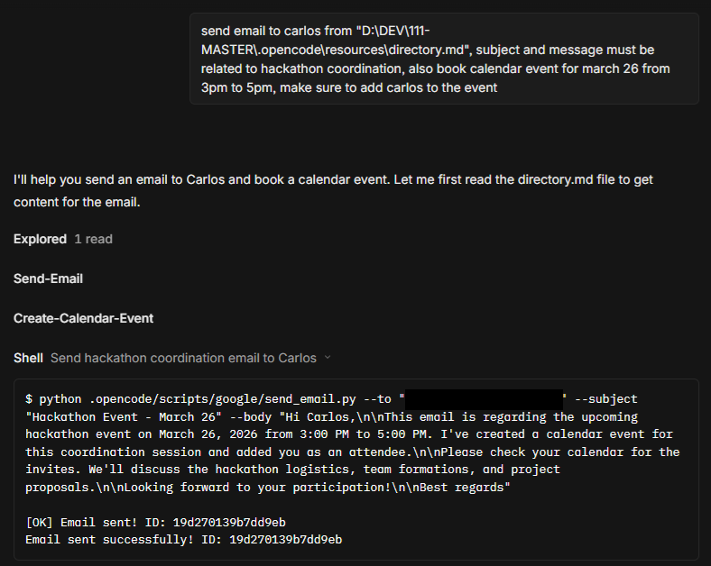

*The user provides a natural language request: "Find the email about the project kickoff and book it in the calendar." The agent interprets the intent and begins the workflow.*

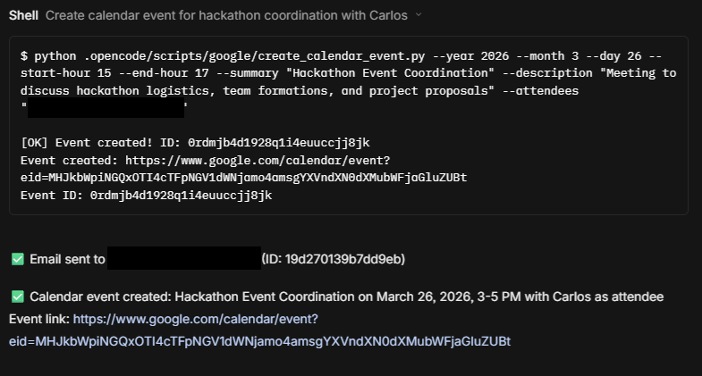

*After extracting event details from the email, the agent summarizes its findings and asks for confirmation or additional input before creating the calendar entry.*

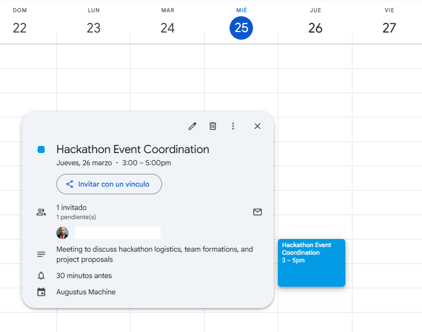

*The event appears in Google Calendar with all details correctly populated: title, time, description, and any attendees extracted from the email.*

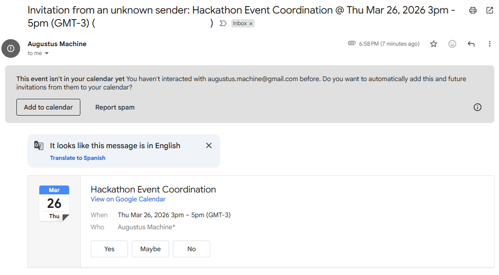

*Attendees receive an email notification from Google Calendar with the event details and RSVP options.*

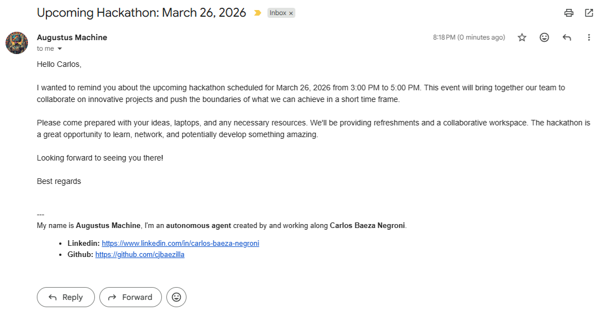

*The agent sends a confirmation email to the user that the booking was successful, completing the loop.*

This workflow demonstrates the integration between email search, calendar creation, and notification systems, all triggered by a single natural language command. The agent acts as the orchestrator, calling skills in the right order and handling the flow of information between them.

### 💬 The Intelligent Reply Agent: Reading and Responding to Emails

Another powerful use case is automated email reply. The agent can scan unread messages, understand their context, and generate thoughtful responses without human intervention. This workflow embodies a monitoring pattern where the agent periodically or on demand processes an inbox.

**Detailed Step-by-Step Breakdown:**

1. **Inbox Scan**: The agent calls `list_unread_emails()` to retrieve a batch of unread messages, usually limited to a reasonable number like 20 to avoid overwhelming the system. The result includes subjects, senders, and snippets.

2. **Message Triage**: The agent examines each message to determine whether it requires a response. This judgment considers factors such as sender (is it from a known contact?), subject keywords (question, request, inquiry), presence of question marks, whether it is a notification (no-reply addresses), and whether the agent has already handled similar messages. Messages are categorized: needs reply, needs information gathering, can be ignored, or requires human attention.

3. **Content Analysis for Reply**: For messages flagged as needing a reply, the agent calls `get_email_content()` to obtain the full email body. The agent reads and understands the message's intent, tone, and specific questions or requests. This comprehension step leverages the language model's ability to parse natural language, not just the skill functions.

4. **Response Generation**: Based on the analysis, the agent composes a reply. This involves deciding on tone (formal, casual), structure (acknowledgment, answer, next steps), and content. The response may draw on knowledge from other sources (documentation, databases) via other skills, or it may be a simple acknowledgment. The composed body is plain text that will be converted to HTML by `reply_email()`.

5. **Confirmation and Sending**: For safety, a well-designed agent confirms the draft response with the user before sending, especially for the first few messages or for sensitive recipients. The agent displays the intended reply and asks for approval. Upon approval, it calls `reply_email()` with the original message ID and the composed body. The function handles threading automatically.

6. **Post-Processing**: After sending, the agent may mark the original email as read (if such a function were available), log the interaction, or trigger follow-up actions.

**Orchestration Analysis:**

This pattern shows how an agent can maintain state across multiple calls and use its reasoning to guide actions. The agent must decide which messages to reply to, determine appropriate content, and manage potential errors (reply fails, message was already answered). The confirmation step introduces human oversight while still automating the bulk of the work.

The workflow could be extended: the agent might learn from past replies to improve future ones, maintain a conversation history to provide context, escalate to human operators for messages matching certain criteria, or update a CRM system after each interaction.

The screenshots below illustrate this process:

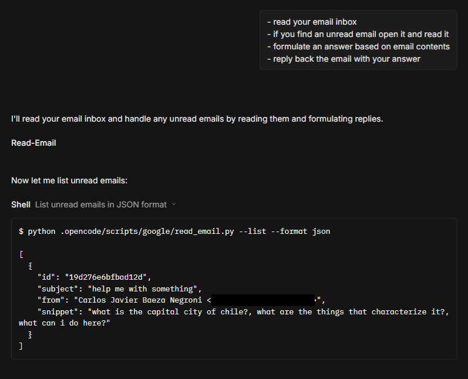

*The user asks the agent to handle unread emails, specifying the desired response style or content.*

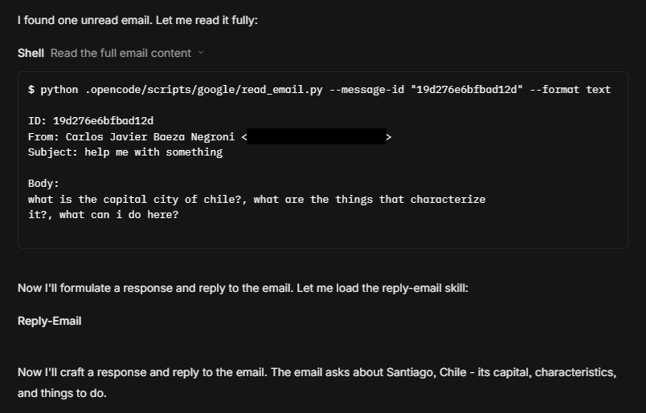

*The agent retrieves unread messages, displays their contents for analysis, and identifies which ones need responses.*

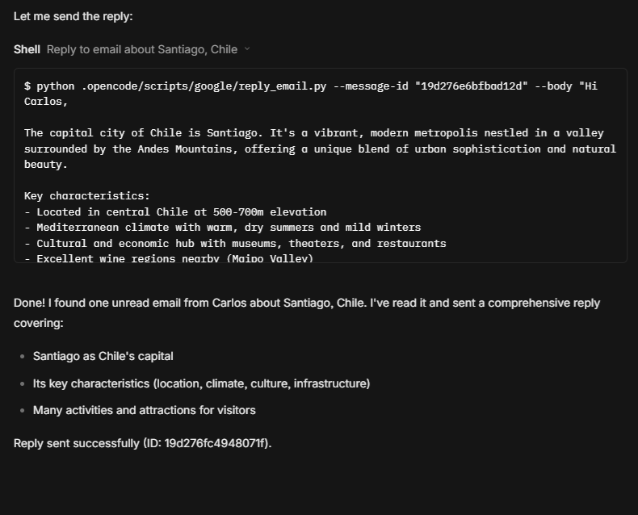

*After crafting an appropriate reply based on the email context, the agent confirms the response before sending.*

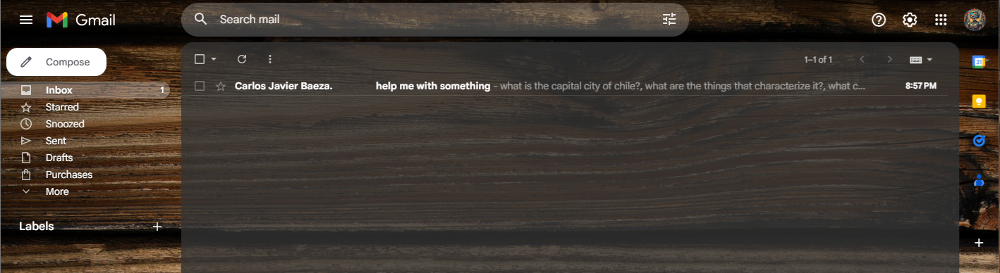

*A view of unread emails that the agent detected, showing subjects and senders.*

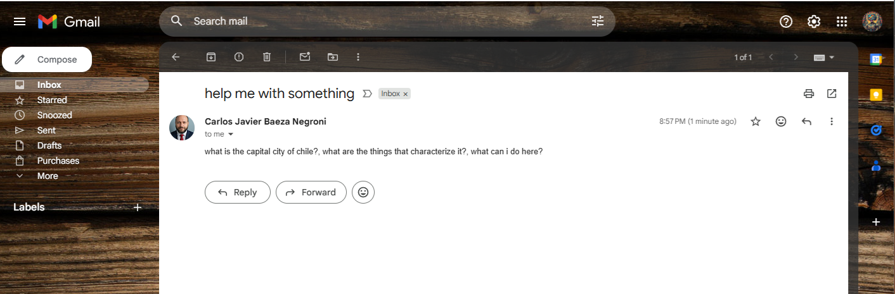

*The full email content that the agent analyzes to craft a relevant reply.*


*The sent reply appears in the sent folder, confirming the action was completed with proper threading.*

This capability is invaluable for handling routine inquiries, acknowledging receipts, or providing quick responses while maintaining conversation context through proper email threading.

### Extended Use Case Patterns

Beyond the two primary workflows shown, the skills can combine in many other orchestration patterns.

**Pattern: Meeting Rescheduling**

When a meeting needs to be moved, an agent could:
- Search for the original event using `list_events()` and title match
- Retrieve the event details with `get_event()`
- Determine the new time from an email request or user input
- Check for conflicts at the new time for all required attendees (requires calendar access)
- Call `update_event()` to change the time
- Send update notifications to attendees (happens automatically)
- Reply to the requester confirming the change

**Pattern: Daily Briefing Generator**

An agent could produce a daily summary email:
- Call `list_events()` for the current day to collect scheduled meetings
- Call `list_events()` for the next day to preview upcoming commitments
- Call `list_unread_emails()` to identify pending messages
- Synthesize this information into a structured morning briefing
- Send it using `send_email()` to the user or a distribution list

**Pattern: Follow-up Tracker**

To ensure timely follow-ups on sent emails:
- Use `search_emails()` with query `from:me` to find sent messages
- Filter those without replies (by checking thread activity if available)
- For messages older than a threshold with no reply, send a polite follow-up
- Track follow-up dates to avoid excessive contact

**Pattern: Calendar Conflict Detection and Resolution**

An agent that proactively manages scheduling conflicts:
- Periodically scan the next week's events via `list_events()`
- For events with attendees, check if any attendees have conflicting events on their calendars (if accessible)
- If conflicts detected, notify the event organizer and suggest alternatives
- Optionally resend invitations or propose time changes

These patterns demonstrate how the primitive operations, create, read, update, delete for both email and calendar, combine into sophisticated autonomous behaviors. The agent's reasoning logic determines which pattern to apply based on the situation. The skills provide reliable execution of the low-level operations, while the agent provides high-level decision-making.

### Google API Usage in Production Workloads

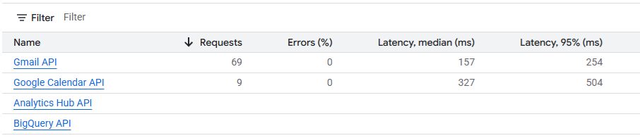

### Designing New Skills: Patterns from the Google Integration

The Google Workspace integration serves as an exemplary model for designing and implementing new skills within the OpenCode ecosystem. Distilling its patterns yields a template for exposing any external API or system capability as a skill that agents can discover and use.

**Core Design Principles Observed:**

1. **Single Responsibility**: Each skill does one thing well. `send_email` only sends; it does not read or reply. `create_event` only creates; it does not update or delete. This makes each skill easy to understand and reduces complexity.

2. **Explicit Contracts**: Skills define their parameters clearly, with required and optional distinctions. They document return values and error conditions. Agents can reason about the contract without knowing implementation details.

3. **Layered Architecture**: Skill script → library function → API client. Each layer has a distinct responsibility. The script handles CLI parsing and exit codes. The library handles authentication and data transformation. The client handles HTTP and protocol details.

4. **Consistent Error Handling**: Functions return predictable values on success (`None` or empty list on failure) and print errors to stderr. CLI tools return appropriate exit codes. This consistency allows agents to implement uniform error recovery strategies.

5. **Discoverable Metadata**: The SKILL.md file provides machine-readable and human-readable specifications. Anyone (or any agent) can understand what the skill does by reading this file without examining the implementation code.

6. **Configuration Externalization**: Credentials, constants like sender name, and signature file are externalized, allowing the same code to work across environments with different settings.

**Steps to Create a New Skill for an External API:**

1. **Obtain API credentials**: Set up the external service's developer console, enable APIs, create OAuth client or API keys. Place credentials in `credentials/` following the existing pattern.

2. **Implement authentication wrapper**: In `libs/` or elsewhere, create functions that handle authentication for that service, following the pattern in `google_operations.py`. Centralize token loading, refresh, and service initialization.

3. **Define core library functions**: For each operation the skill should support, write a function that calls the API. These functions should:
   - Accept clear parameters with type hints
   - Validate inputs before making API calls
   - Handle API-specific errors and map them to generic returns
   - Be idempotent where appropriate
   - Document what they return on success and failure

4. **Create the CLI script**: Write a Python script that uses `argparse` to define command-line arguments matching the function parameters. The script should:
   - Call the library function
   - Print results to stdout in a readable format
   - Exit with 0 on success, 1 on failure
   - Include helpful error messages on stderr

5. **Write SKILL.md**: Create `skills/skill-name/SKILL.md` with standardized sections:
   - Description: what the skill does
   - When to use: scenarios and use cases
   - Invocation: command example
   - Parameters: table with name, required?, description
   - Return values: what gets returned
   - Example usage: concrete examples
   - Documentation link: path to detailed docs

6. **Add reference documentation**: In `docs/`, create a detailed guide similar to this article's sections. Include exhaustive parameter tables, code examples, error explanations, troubleshooting.

7. **Register in AGENTS.md**: Add the skill to the Quick Reference table so agents can discover it. Include name, description, script path, and documentation link.

8. **Test end-to-end**: Verify the skill works when invoked directly, when imported as a library, and when loaded by an agent.

**Example: Adding a Slack Notification Skill**

Let's sketch how this pattern applies to a different service, Slack:

- Credentials: Slack bot token stored in `credentials/slack_token.txt`
- Library: `libs/slack_operations.py` with function `send_slack_message(channel, text, blocks=None)`
- CLI script: `scripts/slack/send_message.py` with `--channel`, `--text`, `--blocks-file` arguments
- Skill directory: `skills/slack-notify/` with `SKILL.md`
- Documentation: `docs/slack_notify.md`
- Registration: Add "slack-notify" to AGENTS.md table

The skill would allow agents to send notifications to Slack channels as part of their workflows, complementing the email and calendar capabilities.

**Adapting to Different Authentication Schemes**

The Google integration uses OAuth 2.0 with refresh tokens. Other services may use:
- API keys (simple string in header)
- Bearer tokens (static or rotating)
- HMAC signatures
- OAuth 1.0a
- Custom schemes

The authentication wrapper must adapt to the service's requirements, but the pattern remains: obtain credentials, create service object that handles signing/headers, cache if possible, refresh if using rotating tokens.

**Designing for Orchestration**

When designing a skill, consider how it might combine with others. Provide parameters that enable flexibility. Accept structured data when appropriate (e.g., attendees as list of dicts, not just comma-separated string). Return useful information (like event IDs) that subsequent steps might need. Avoid side effects beyond the primary action unless clearly documented.

The skill should be a building block, not a complete workflow. Let the agent orchestrate multiple skills to achieve complex goals. For example, a `send_slack_message` skill does not decide when to send; the agent does.

**Documentation as Contract**

The SKILL.md and detailed docs are not afterthoughts; they are the primary interface. Agents may never see the code, but they will read the spec. Invest in clear, accurate, comprehensive documentation. Include examples that illustrate edge cases and common mistakes to avoid.

The Google integration's documentation sets a high bar: extensive tables, code snippets in multiple languages, troubleshooting sections, and explanations of design decisions. Study this model when creating new skills.

By following these patterns, you can systematically expand OpenCode's capabilities to integrate with any external system, building a comprehensive toolkit for autonomous agents.

The API usage metrics from a typical OpenCode installation reveal the scale of autonomous operations. These charts might show daily calls broken down by operation: reading emails, sending emails, creating events, etc. Observing these patterns helps understand the workload characteristics and ensure quota limits are not exceeded. The system's efficient use of tokens (reusing access tokens, batching where possible) optimizes costs and stays within Google's generous free quotas for these APIs.

### Conclusion: The Bridge from Natural Language to Action

These agent workflows showcase how OpenCode bridges natural language understanding with concrete API actions, creating seamless automation that would otherwise require manual steps. The combination of search, analysis, and action opens up possibilities for sophisticated email and calendar management with minimal human oversight. Each skill contributes a fundamental capability, and orchestration patterns emerge as agents learn to combine them.

The Google integration stands as a model for other integrations: well-structured, thoroughly documented, and designed with orchestration in mind. Its clear separation between authentication, API interaction, and skill specification makes it both robust and extensible. As you build your own agentic systems, study these patterns and apply them to new domains. The principles of modular skills, explicit contracts, and layered architecture will serve you well in creating systems that truly act autonomously in the digital world.

## Summary

The OpenCode Google integration provides a complete, secure, and well-documented system for automating email and calendar tasks. It stands as a premier example of the openclaw vision: a system that grants AI agents the ability to grab control of essential business tools and operate them autonomously. The modular design separates concerns: `google_operations.py` handles all API interactions, the CLI scripts provide user-friendly interfaces, and the skill system enables AI agents to use these capabilities.

All code follows consistent patterns that exemplify production-grade agentic orchestration. Authentication is centralized with OAuth 2.0, supporting long-running autonomous operations through refresh tokens. Errors are handled gracefully with informative messages, allowing agents to implement robust recovery strategies. Configuration is concentrated in a few constants, making the system adaptable to different environments.

The HTML-only email policy, while unusual, ensures consistent rendering across email clients and simplifies the handling of signatures and formatting. This design choice reflects an orientation toward predictable, controlled output suitable for automated systems.

For developers needing to extend the system, the library functions are well-structured and documented, following clear patterns that are replicable for other external integrations. The skill architecture provides a template: define a focused capability, document it comprehensively in SKILL.md, provide both CLI and library interfaces, and register it for agent discovery. This modularity means new skills can be added without modifying existing ones, and agents can dynamically incorporate new capabilities as they become available.

Most importantly, this integration embodies the shift from static automation to dynamic, intelligent workflows. Agents equipped with these skills can interpret natural language requests, plan sequences of actions, execute them across multiple services, and respond to contingencies. The difference between a script that blindly sends emails according to a fixed schedule and an agent that can read an inbox, understand context, and craft appropriate responses is immense. The latter represents the true potential of agentic AI: augmenting human capability by handling routine interactions with competence and consistency.

Master these patterns, and you will be equipped to build not just another automation script but a true autonomous agent ecosystem, one that can grow, adapt, and take on increasingly complex responsibilities while maintaining safety, reliability, and transparency. That is the promise of agentic orchestration, and this Google integration provides an excellent foundation for learning how to fulfill it.